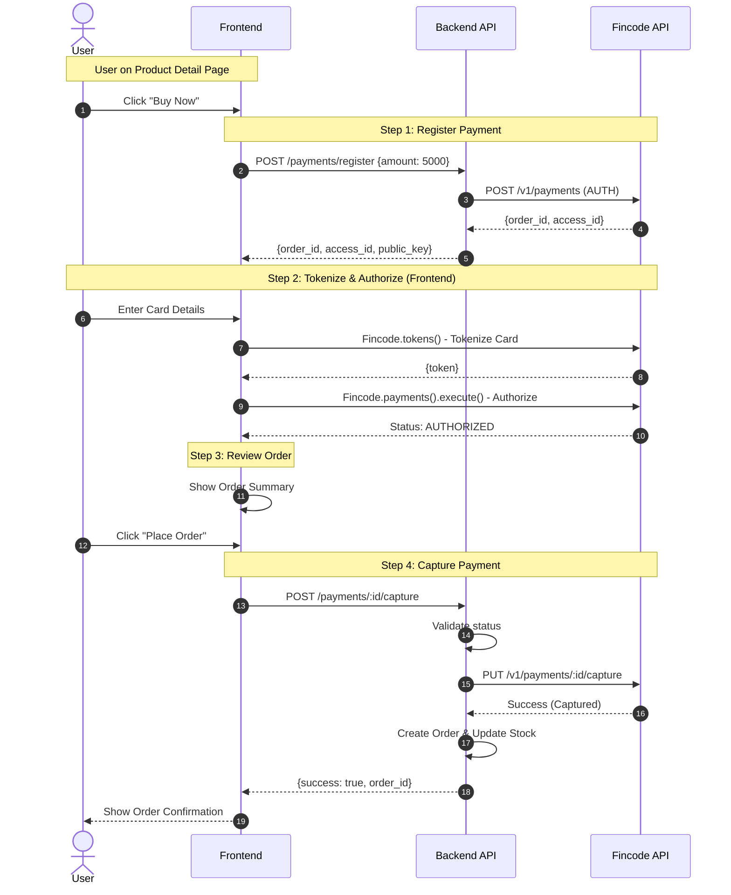
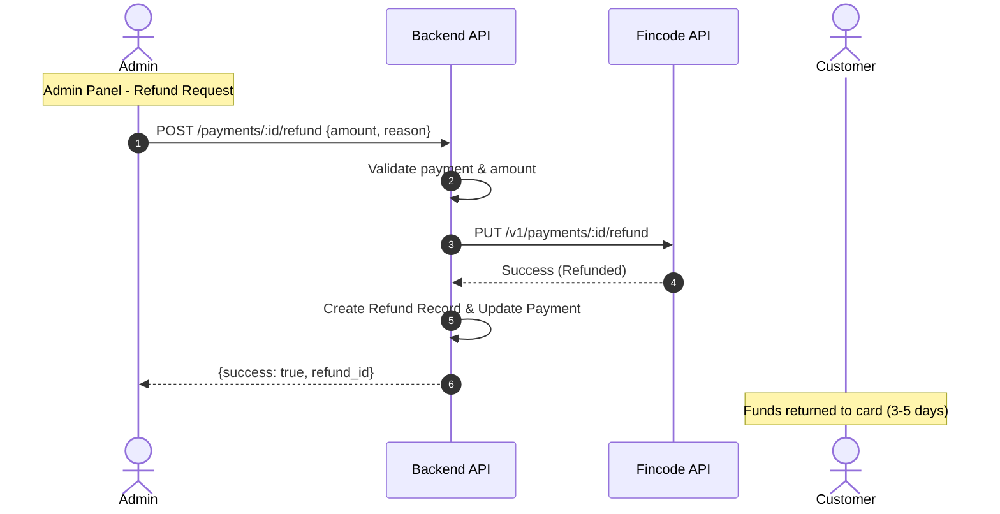
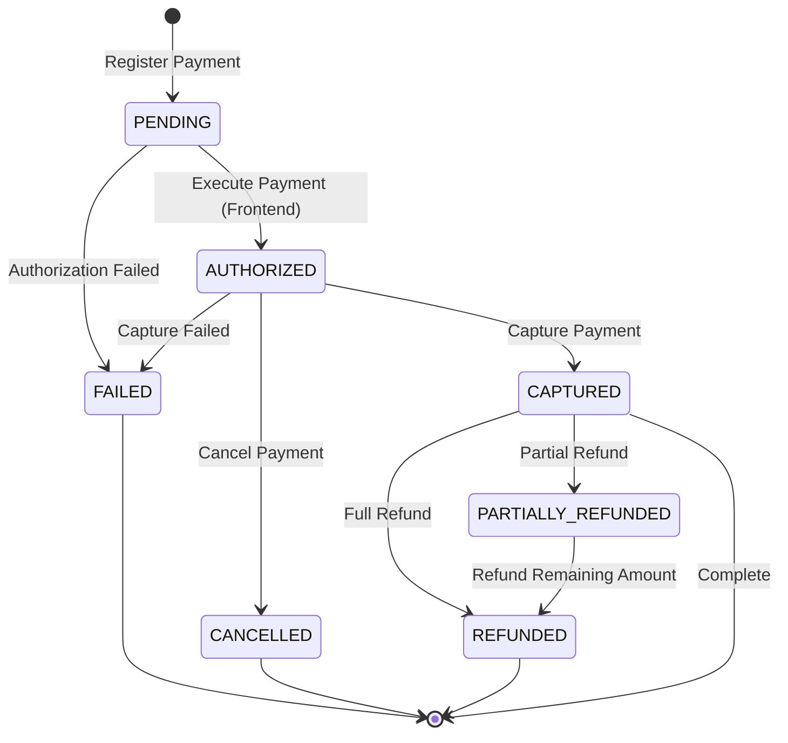

# Fincode Payment Integration - Complete Technical Documentation

**Last Updated**: 2026-01-19  
**Architecture**: Clean Service Layer with Gateway Pattern  
**Payment Provider**: Fincode (Japan)

---

## Table of Contents

1. [Overview](#overview)
2. [Architecture](#architecture)
3. [Payment Operations](#payment-operations)
4. [Payment State Machine](#payment-state-machine)
5. [API Reference](#api-reference)
6. [Implementation Guide](#implementation-guide)
7. [Error Handling](#error-handling)
8. [Testing](#testing)
9. [Security](#security)

---

## Overview

### Design Goals

- **Streamlined Purchase**: Direct purchases from product detail pages
- **Security First**: PCI DSS compliance through client-side tokenization
- **Flexible Cancellation**: Support cancellation before capture
- **Full Refund Support**: Both full and partial refunds for captured payments
- **Multi-Gateway Ready**: Abstracted gateway interface for future payment providers

### Two-Phase Payment Model

Fincode implements a **authorize-then-capture** model with frontend tokenization:

```
┌──────────────┐      ┌─────────────┐      ┌─────────────┐      ┌──────────────┐
│   REGISTER   │─────▶│  TOKENIZE   │─────▶│   EXECUTE   │─────▶│   CAPTURE    │
│   (Backend)  │      │  (Frontend) │      │  (Frontend) │      │  (Backend)   │
│              │      │             │      │             │      │              │
│ Create       │      │ Card → Token│      │ Authorize   │      │ Charge Card  │
│ Payment      │      │ (PCI Safe)  │      │ Payment     │      │ Complete     │
└──────────────┘      └─────────────┘      └─────────────┘      └──────────────┘
                                                   │                      │
                                                   ▼                      ▼
                                            ┌─────────────┐      ┌──────────────┐
                                            │   CANCEL    │      │    REFUND    │
                                            │  (Backend)  │      │  (Backend)   │
                                            │             │      │              │
                                            │ Release Hold│      │ Return Funds │
                                            └─────────────┘      └──────────────┘
```

**Key Steps**:
1. **Register** (Backend): Create payment session on Fincode
2. **Tokenize** (Frontend): Convert card details to secure token (Fincode SDK)
3. **Execute** (Frontend): Authorize payment with token - funds reserved but not charged
4. **Capture** (Backend): Actually charge the card and complete purchase
5. **Cancel** (Backend): Release authorization before capture (optional)
6. **Refund** (Backend): Return funds after capture (optional)


---

## Architecture

### End-to-End Payment Flow

The following diagram shows the complete payment flow from user interaction to order completion:



### Refund Flow (Post-Purchase)



---

### Clean Architecture Layers

```
┌─────────────────────────────────────────────────────────┐
│                    Controllers                          │
│              (API/V1::PaymentsController)               │
└────────────────────┬────────────────────────────────────┘
                     │
┌────────────────────▼────────────────────────────────────┐
│                 Service Layer                           │
│            (Payments::PaymentService)                   │
│  • Business logic orchestration                         │
│  • Validation                                           │
│  • Database operations                                  │
└────────────────────┬────────────────────────────────────┘
                     │
┌────────────────────▼────────────────────────────────────┐
│              Gateway Layer (Strategy Pattern)           │
│         (Payments::Gateways::BaseGateway)               │
│                        │                                │
│         ┌──────────────┴──────────────┐                │
│         ▼                              ▼                │
│  FincodeGateway              StripeGateway (future)     │
└────────────────────┬────────────────────────────────────┘
                     │
┌────────────────────▼────────────────────────────────────┐
│              HTTP Client Layer                          │
│       (Payments::Gateways::FincodeClient)               │
│  • Low-level API communication                          │
│  • Error handling                                       │
│  • Response parsing                                     │
└─────────────────────────────────────────────────────────┘
```

### Key Components

#### 1. **PaymentService** (Service Layer)
```ruby
module Payments
  class PaymentService
    attr_reader :current_user, :gateway

    def initialize(current_user, gateway: nil)
      @current_user = current_user
      @gateway = gateway || Payments::Gateways::FincodeGateway.new
    end

    def register_payment(amount:)
      # Business logic here
    end

    def capture_payment(payment_id:)
      # Business logic here
    end
    
    # ... other methods
  end
end
```

**Responsibilities**:
- Orchestrate business logic
- Validate business rules
- Manage database transactions
- Call gateway for external API operations

#### 2. **BaseGateway** (Gateway Interface)
```ruby
module Payments
  module Gateways
    class BaseGateway
      def register(amount:, user:)
        raise NotImplementedError
      end

      def capture(order_id:, access_id:, amount:)
        raise NotImplementedError
      end

      def cancel(order_id:, access_id:)
        raise NotImplementedError
      end

      def refund(order_id:, access_id:, amount:)
        raise NotImplementedError
      end
    end
  end
end
```

**Responsibilities**:
- Define payment gateway contract
- Enable multi-gateway support (Strategy Pattern)

#### 3. **FincodeGateway** (Concrete Gateway)
```ruby
module Payments
  module Gateways
    class FincodeGateway < BaseGateway
      def initialize(fincode_client = nil)
        @fincode_client = fincode_client || FincodeClient.new
      end

      def register(amount:, user:)
        order_id = generate_order_id
        
        result = handle_errors do
          @fincode_client.register(
            order_id: order_id,
            amount: amount,
            customer_info: {
              email: user.email,
              name: user.display_name
            }
          )
        end

        {
          id: result['id'],
          access_id: result['access_id'],
          amount: amount
        }
      end

      private

      def handle_errors
        yield
      rescue FincodeClient::FincodeError => e
        raise Payments::Error, e.message
      end
    end
  end
end
```

**Responsibilities**:
- Adapt Fincode API to gateway interface
- Transform data formats
- Handle Fincode-specific errors

#### 4. **FincodeClient** (HTTP Client)
```ruby
module Payments
  module Gateways
    class FincodeClient
      include HTTParty
      base_uri ENV['FINCODE_API_URL']
      
      class FincodeError < StandardError; end

      def register(order_id:, amount:, customer_info: {})
        response = self.class.post(
          '/v1/payments',
          headers: headers,
          body: {
            pay_type: 'Card',
            job_code: 'AUTH',
            amount: amount.to_s,
            tax: '0',
            id: order_id,
            client_field_1: customer_info[:email],
            client_field_2: customer_info[:name]
          }.to_json
        )

        handle_response(response)
      end

      private

      def handle_response(response)
        case response.code
        when 200, 201
          response.parsed_response
        when 400
          raise FincodeError, "Bad Request"
        when 401
          raise FincodeError, "Unauthorized"
        # ... other error codes
        end
      end
    end
  end
end
```

**Responsibilities**:
- Make HTTP requests to Fincode API
- Parse responses
- Raise appropriate errors

### Error Handling Strategy

```ruby
# app/services/payments.rb
module Payments
  class Error < StandardError; end
  class ValidationError < Error; end
  class NotFoundError < Error; end
end

# app/controllers/application_controller.rb
class ApplicationController < ActionController::API
  rescue_from Payments::NotFoundError, with: :render_payment_not_found
  rescue_from Payments::ValidationError, with: :render_payment_validation_error
  rescue_from Payments::Error, with: :render_payment_error

  private

  def render_payment_not_found(exception)
    render json: { success: false, error: exception.message }, status: :not_found
  end

  def render_payment_validation_error(exception)
    render json: { success: false, error: exception.message }, status: :unprocessable_entity
  end

  def render_payment_error(exception)
    render json: { success: false, error: exception.message }, status: :unprocessable_entity
  end
end
```

**Benefits**:
- Centralized error handling
- Consistent error responses
- Clean controller code (no rescue blocks)

---

## Payment Operations

### 1. Register Payment

**Purpose**: Initialize payment session on Fincode

**When**: User confirms intent to purchase from product detail page

**Backend Endpoint**: `POST /api/v1/payments/register`

**Request**:
```json
{
  "amount": 5000
}
```

**Response**:
```json
{
  "success": true,
  "order_id": "ORD_1737273600_a1b2c3d4e5f6",
  "access_id": "a_9876543210fedcba",
  "amount": 5000,
  "public_key": "pk_test_..."
}
```

**Implementation**:
```ruby
def register_payment(amount:)
  validate_amount!(amount)
  
  public_key = ENV.fetch('FINCODE_PUBLIC_KEY')
  
  result = gateway.register(
    amount: amount,
    user: current_user
  )

  payment = Payment.create!(
    user: current_user,
    fincode_order_id: result[:id],
    fincode_access_id: result[:access_id],
    amount: amount,
    status: :authorized,
    authorized_at: Time.current,
    customer_email: current_user.email
  )

  {
    order_id: payment.fincode_order_id,
    access_id: payment.fincode_access_id,
    amount: payment.amount,
    public_key: public_key
  }
end

private

def validate_amount!(amount)
  raise Payments::ValidationError, 'Invalid amount' if amount.nil? || amount < 100
end
```

**Fincode API Call**:
```http
POST /v1/payments
Content-Type: application/json
Authorization: Bearer {SECRET_KEY}

{
  "pay_type": "Card",
  "job_code": "AUTH",
  "amount": "5000",
  "tax": "0",
  "id": "ORD_1737273600_a1b2c3d4e5f6",
  "client_field_1": "user@example.com",
  "client_field_2": "John Doe"
}
```

---

### 2. Execute Payment (Authorization)

**Purpose**: Tokenize card and authorize payment

**When**: User submits card details on payment form

**Process**: **Entirely on frontend** using Fincode SDK

**Frontend Implementation**:
```javascript
// Initialize Fincode SDK
const fincodeInstance = Fincode(publicKey);

// Step 1: Tokenize Card
fincodeInstance.tokens(
  {
    card_no: '4111111111111111',
    expire: '2512',  // YYMM format
    holder_name: 'TARO YAMADA',
    security_code: '123'
  },
  function(status, response) {
    if (status === 200 || status === 201) {
      const token = response.id;
      authorizePayment(token);
    } else {
      handleError(response.errors);
    }
  }
);

// Step 2: Execute Payment (Authorize)
function authorizePayment(token) {
  fincodeInstance.payments(
    {
      id: orderId,              // From register response
      pay_type: 'Card',
      access_id: accessId,      // From register response
      token: token,
      method: '1',              // 1: Lump sum payment
      card_no: cardNumber,
      expire: expireDate,
      holder_name: holderName,
      security_code: cvv
    },
    function(status, response) {
      if (status === 200) {
        // Payment authorized - show confirmation screen
        showConfirmationScreen(response);
      } else {
        handleError(response.errors);
      }
    }
  );
}
```

**After Success**: Payment status becomes `AUTHORIZED` - funds are reserved but not yet charged

---

### 3. Confirm Payment

**Purpose**: Sync payment status after frontend authorization

**Backend Endpoint**: `POST /api/v1/payments/:id/confirm`

**Response**:
```json
{
  "success": true,
  "payment_id": 123,
  "status": "authorized",
  "authorized_at": "2026-01-19T09:00:00Z",
  "amount": 5000
}
```

**Implementation**:
```ruby
def confirm_payment(payment_id:)
  payment = find_payment!(payment_id)

  {
    payment_id: payment.id,
    status: payment.status,
    authorized_at: payment.authorized_at,
    amount: payment.amount
  }
end
```

---

### 4. Capture Payment

**Purpose**: Actually charge the customer's card

**Backend Endpoint**: `POST /api/v1/payments/:id/capture`

**Response**:
```json
{
  "success": true,
  "payment_id": 123,
  "status": "captured",
  "captured_at": "2026-01-19T09:05:00Z",
  "amount": 5000,
  "message": "Payment captured successfully"
}
```

**Implementation**:
```ruby
def capture_payment(payment_id:)
  payment = find_payment!(payment_id)
  
  validate_can_capture!(payment)

  gateway.capture(
    order_id: payment.fincode_order_id,
    access_id: payment.fincode_access_id,
    amount: payment.amount
  )

  payment.update!(
    status: :captured,
    captured_at: Time.current
  )

  {
    payment_id: payment.id,
    status: payment.status,
    captured_at: payment.captured_at,
    amount: payment.amount
  }
end

private

def validate_can_capture!(payment)
  return if payment.status == 'authorized'
  
  raise Payments::ValidationError, 'Payment must be authorized to capture'
end
```

---

### 5. Cancel Payment

**Purpose**: Cancel an authorized payment before capture

**Backend Endpoint**: `POST /api/v1/payments/:id/cancel`

**Restrictions**:
- Only `AUTHORIZED` payments can be cancelled
- Cannot cancel after capture (use refund instead)

**Response**:
```json
{
  "success": true,
  "payment_id": 123,
  "status": "cancelled",
  "canceled_at": "2026-01-19T09:03:00Z",
  "amount": 5000,
  "message": "Payment cancelled successfully"
}
```

**Implementation**:
```ruby
def cancel_payment(payment_id:)
  payment = find_payment!(payment_id)
  
  validate_can_cancel!(payment)

  gateway.cancel(
    order_id: payment.fincode_order_id,
    access_id: payment.fincode_access_id
  )

  payment.update!(
    status: :cancelled,
    canceled_at: Time.current
  )

  {
    payment_id: payment.id,
    status: payment.status,
    canceled_at: payment.canceled_at,
    amount: payment.amount
  }
end

private

def validate_can_cancel!(payment)
  return if payment.can_cancel?
  
  raise Payments::ValidationError, 'Payment cannot be cancelled'
end
```

---

### 6. Refund Payment

**Purpose**: Return funds to customer after capture

**Backend Endpoint**: `POST /api/v1/payments/:id/refund`

**Types**:
- **Full Refund**: Entire payment amount
- **Partial Refund**: Portion of payment amount

**Request**:
```json
{
  "amount": 2000,  // Optional: omit for full refund
  "reason": "Customer requested refund"
}
```

**Response**:
```json
{
  "success": true,
  "refund_id": 456,
  "payment_id": 123,
  "amount": 2000,
  "status": "completed",
  "remaining_amount": 3000,
  "message": "Refund processed successfully"
}
```

**Implementation**:
```ruby
def refund_payment(payment_id:, amount: nil, reason: nil)
  payment = find_payment!(payment_id)
  
  validate_can_refund!(payment)

  refund_amount = amount || payment.amount
  validate_refund_amount!(payment, refund_amount)

  result = gateway.refund(
    order_id: payment.fincode_order_id,
    access_id: payment.fincode_access_id,
    amount: refund_amount
  )

  refund = Refund.create!(
    payment: payment,
    amount: refund_amount,
    reason: reason,
    status: :completed,
    processed_by: current_user,
    processed_at: Time.current,
    fincode_refund_id: result[:id]
  )

  update_payment_refund_status!(payment, refund_amount)

  {
    refund_id: refund.id,
    payment_id: payment.id,
    amount: refund_amount,
    status: refund.status,
    remaining_amount: payment.refundable_amount
  }
end

private

def validate_can_refund!(payment)
  return if payment.can_refund?
  
  raise Payments::ValidationError, 'Only captured payments can be refunded'
end

def validate_refund_amount!(payment, refund_amount)
  remaining = payment.refundable_amount

  if refund_amount > remaining
    raise Payments::ValidationError, "Refund amount exceeds remaining amount (¥#{remaining})"
  end

  raise Payments::ValidationError, 'Refund amount must be greater than 0' if refund_amount <= 0
end

def update_payment_refund_status!(payment, refund_amount)
  new_status = if fully_refunded?(payment, refund_amount)
                 :refunded
               else
                 :partially_refunded
               end

  payment.update!(status: new_status)
end

def fully_refunded?(payment, refund_amount)
  total_refunded = payment.total_refunded + refund_amount
  total_refunded >= payment.amount
end
```

---

## Payment State Machine

### State Transition Diagram



### State Descriptions

| State | Description | Available Actions |
|-------|-------------|-------------------|
| `PENDING` | Payment registered, awaiting authorization | Execute, Expire |
| `AUTHORIZED` | Funds reserved on card | Capture, Cancel |
| `CAPTURED` | Payment complete, funds charged | Refund |
| `CANCELLED` | Authorization cancelled | None (terminal) |
| `FAILED` | Payment failed | None (terminal) |
| `PARTIALLY_REFUNDED` | Some funds returned | Refund (remaining) |
| `REFUNDED` | Fully refunded | None (terminal) |

### Business Rules

```ruby
class Payment < ApplicationRecord
  enum status: {
    pending: 'pending',
    authorized: 'authorized',
    captured: 'captured',
    failed: 'failed',
    cancelled: 'cancelled',
    partially_refunded: 'partially_refunded',
    refunded: 'refunded'
  }
  
  def can_capture?
    authorized? && !captured? && !failed? && !cancelled?
  end
  
  def can_cancel?
    authorized? && !captured? && !failed? && !cancelled?
  end
  
  def can_refund?
    captured? || partially_refunded?
  end
  
  def refundable_amount
    return 0 unless can_refund?
    amount - refunds.completed.sum(:amount)
  end

  def total_refunded
    refunds.completed.sum(:amount)
  end
end
```

---

## API Reference

### Backend REST API Endpoints

| Method | Endpoint | Purpose | Auth Required |
|--------|----------|---------|---------------|
| POST | `/api/v1/payments/register` | Initialize payment | Yes |
| POST | `/api/v1/payments/:id/confirm` | Confirm authorization | Yes |
| POST | `/api/v1/payments/:id/capture` | Capture payment | Yes |
| POST | `/api/v1/payments/:id/cancel` | Cancel authorization | Yes |
| POST | `/api/v1/payments/:id/refund` | Issue refund | Yes |
| GET | `/api/v1/payments/:id` | Get payment details | Yes |
| GET | `/api/v1/payments` | List payments | Yes |

### Fincode API Endpoints

| Method | Endpoint | Purpose |
|--------|----------|---------|
| POST | `/v1/payments` | Register payment |
| PUT | `/v1/payments/:id/capture` | Capture authorized payment |
| PUT | `/v1/payments/:id/cancel` | Cancel authorization |
| PUT | `/v1/payments/:id/refund` | Process refund |

---

## Database Schema

### Payments Table

```ruby
create_table :payments do |t|
  t.references :user, foreign_key: true
  t.references :order, foreign_key: true
  t.string :fincode_order_id, null: false, index: { unique: true }
  t.string :fincode_access_id, null: false
  t.string :fincode_transaction_id
  t.integer :amount, null: false
  t.integer :tax, default: 0
  t.string :status, default: 'pending', null: false
  t.integer :capture_amount
  t.string :customer_email
  t.datetime :authorized_at
  t.datetime :captured_at
  t.datetime :canceled_at
  t.text :error_message
  t.timestamps
end
```

### Refunds Table

```ruby
create_table :refunds do |t|
  t.references :payment, null: false, foreign_key: true
  t.references :processed_by, foreign_key: { to_table: :users }
  t.integer :amount, null: false
  t.text :reason
  t.string :status, default: 'pending', null: false
  t.string :fincode_refund_id, index: true
  t.datetime :processed_at
  t.timestamps
end

add_index :refunds, :status
```

---

## Security

### PCI DSS Compliance

- **Card data never touches backend**: All card details are tokenized on frontend
- **Fincode SDK handles tokenization**: Secure, PCI-compliant process
- **No card storage**: Backend only stores payment references

### API Security

```ruby
# For development
FINCODE_API_URL=https://api.test.fincode.jp
FINCODE_SECRET_KEY=sk_test_...
FINCODE_PUBLIC_KEY=pk_test_...

# For production
FINCODE_API_URL=https://api.fincode.jp
FINCODE_SECRET_KEY=sk_live_...
FINCODE_PUBLIC_KEY=pk_live_...
```

### Authentication

All API endpoints require valid JWT token:
```http
Authorization: Bearer {access_token}
```

## Future Enhancements

### Multi-Gateway Support

To add Stripe support:

```ruby
# app/services/payments/gateways/stripe_gateway.rb
module Payments
  module Gateways
    class StripeGateway < BaseGateway
      def register(amount:, user:)
        # Stripe implementation
      end

      def capture(order_id:, access_id:, amount:)
        # Stripe implementation
      end
    end
  end
end

# Usage
service = Payments::PaymentService.new(
  user,
  gateway: Payments::Gateways::StripeGateway.new
)
```

### Webhook Support

```ruby
# app/controllers/api/v1/fincode_webhooks_controller.rb
class Api::V1::FincodeWebhooksController < ApplicationController
  skip_before_action :authenticate_request

  def create
    event = verify_webhook_signature(request.body.read)
    
    case event['type']
    when 'payment.authorized'
      handle_payment_authorized(event['data'])
    when 'payment.captured'
      handle_payment_captured(event['data'])
    end

    head :ok
  end
end
```

---

**End of Documentation**

---

## Fincode Reference

### Test Cards

For testing payment flows in development/staging environments, use these test card numbers:

#### Credit Cards (Success Cases)

| Card Brand | Card Number | Expiry | CVV | Expected Result |
|------------|-------------|--------|-----|-----------------|
| VISA | `4111111111111111` | Any future date (YYMM) | `123` | Success |
| MasterCard | `5555555555554444` | Any future date (YYMM) | `123` | Success |
| JCB | `3566111111111113` | Any future date (YYMM) | `123` | Success |
| American Express | `378282246310005` | Any future date (YYMM) | `1234` | Success |
| Diners Club | `36227206271667` | Any future date (YYMM) | `123` | Success |

#### Error Test Cases

| Card Number | Expected Error |
|-------------|----------------|
| `4000000000000002` | Card declined |
| `4000000000000069` | Expired card |
| `4000000000000127` | Incorrect CVV |
| `4000000000000119` | Processing error |

**Note**: 
- Expiry format: `YYMM` (e.g., `2512` for December 2025)
- Holder name: Any valid name (e.g., `TARO YAMADA`)
- CVV: 3 digits for most cards, 4 digits for Amex

**Reference**: [Fincode Test Resources](https://docs.fincode.jp/develop_support/test_resources)

---

### Refund Policies by Payment Method

Different payment methods have different refund policies and timelines:

#### Credit Card Refunds

| Payment Method | Refund Type | Processing Time | Notes |
|----------------|-------------|-----------------|-------|
| Credit Card | Full Refund | 3-5 business days | Funds returned to original card |
| Credit Card | Partial Refund | 3-5 business days | Multiple partial refunds allowed |
| Credit Card | Same-day Refund | Immediate (if before settlement) | Only before daily settlement cutoff |

**Important Notes**:
- **Settlement Timing**: Credit card payments are typically settled once per day (usually around midnight JST)
- **Before Settlement**: Refunds processed before settlement are instant
- **After Settlement**: Refunds take 3-5 business days to appear on customer's statement
- **Partial Refunds**: You can issue multiple partial refunds up to the original payment amount
- **Refund Limit**: Total refunds cannot exceed the original payment amount

#### Refund Restrictions

- Cannot refund a payment that is still in `AUTHORIZED` state (use Cancel instead)
- Cannot refund more than the original payment amount
- Cannot refund a payment that has already been fully refunded
- Can issue multiple partial refunds
- Can refund any amount from ¥1 up to remaining amount

**Reference**: [Fincode Payment Notes](https://docs.fincode.jp/payment/note)

---

### Error Codes Reference

Common Fincode API error codes and their meanings:

#### HTTP Status Codes

| Status Code | Meaning | Common Causes |
|-------------|---------|---------------|
| `200` | Success | Request processed successfully |
| `201` | Created | Resource created successfully |
| `400` | Bad Request | Invalid request parameters |
| `401` | Unauthorized | Invalid or missing API key |
| `403` | Forbidden | API key lacks required permissions |
| `404` | Not Found | Payment/resource not found |
| `422` | Unprocessable Entity | Business logic validation failed |
| `500` | Internal Server Error | Fincode server error |
| `503` | Service Unavailable | Fincode maintenance or downtime |

#### Common Error Responses

**400 Bad Request**:
```json
{
  "errors": [
    {
      "error_code": "E01010001",
      "error_message": "Invalid parameter: amount must be greater than 0"
    }
  ]
}
```

**403 Forbidden**:
```json
{
  "errors": [
    {
      "error_code": "E01020001",
      "error_message": "Insufficient funds"
    }
  ]
}
```

**404 Not Found**:
```json
{
  "errors": [
    {
      "error_code": "E01030001",
      "error_message": "Payment not found"
    }
  ]
}
```

#### Error Handling Best Practices

1. **Always check HTTP status code first**
2. **Parse error response for detailed error messages**
3. **Log error codes for debugging**
4. **Show user-friendly messages to customers**
5. **Implement retry logic for 5xx errors**

**Example Error Handler**:
```ruby
def handle_fincode_error(response)
  case response.code
  when 400
    errors = parse_errors(response)
    Rails.logger.error("Fincode 400: #{errors}")
    raise Payments::ValidationError, "Invalid request: #{errors}"
  when 401
    Rails.logger.error("Fincode 401: Unauthorized")
    raise Payments::Error, "Authentication failed"
  when 403
    errors = parse_errors(response)
    Rails.logger.error("Fincode 403: #{errors}")
    raise Payments::Error, "Payment declined: #{errors}"
  when 404
    raise Payments::NotFoundError, "Payment not found"
  when 500..599
    Rails.logger.error("Fincode 5xx: Server error")
    raise Payments::Error, "Payment service temporarily unavailable"
  end
end
```

**Reference**: [Fincode Error Codes](https://docs.fincode.jp/develop_support/error)

---

### API Documentation

Complete Fincode API documentation and resources:

#### Core API Documentation

- **API Reference**: [https://docs.fincode.jp/api](https://docs.fincode.jp/api)
- **Payment API**: [https://docs.fincode.jp/api#tag/payment](https://docs.fincode.jp/api#tag/payment)
- **Card API**: [https://docs.fincode.jp/api#tag/card](https://docs.fincode.jp/api#tag/card)
- **Customer API**: [https://docs.fincode.jp/api#tag/customer](https://docs.fincode.jp/api#tag/customer)

#### Integration Guides

- **Getting Started**: [https://docs.fincode.jp/getting_started](https://docs.fincode.jp/getting_started)
- **Authentication**: [https://docs.fincode.jp/authentication](https://docs.fincode.jp/authentication)
- **Webhooks**: [https://docs.fincode.jp/webhooks](https://docs.fincode.jp/webhooks)
- **Security**: [https://docs.fincode.jp/security](https://docs.fincode.jp/security)

#### SDK & Libraries

- **JavaScript SDK**: For frontend tokenization and payment execution
- **REST API**: For backend payment operations
- **Webhook Events**: For real-time payment status updates

#### Support Resources

- **Test Environment**: Use test API keys for development
- **Sandbox**: Full-featured test environment
- **Support**: Contact Fincode support for production issues
- **Status Page**: Check Fincode service status

---

## Additional Resources

### Environment Variables

Required environment variables for Fincode integration:

```bash
# Fincode API Configuration
FINCODE_API_URL=https://api.fincode.jp
FINCODE_SECRET_KEY=sk_test_...  # Backend API key
FINCODE_PUBLIC_KEY=pk_test_...  # Frontend SDK key

# Use production keys in production
# FINCODE_SECRET_KEY=sk_live_...
# FINCODE_PUBLIC_KEY=pk_live_...
```
---

**End of Documentation**
