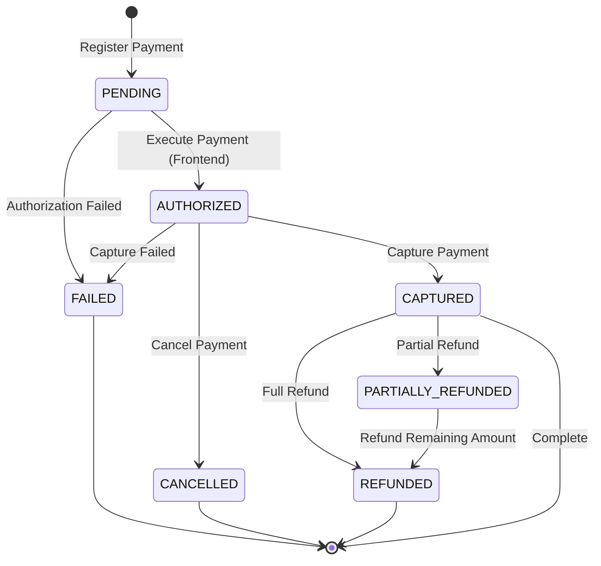
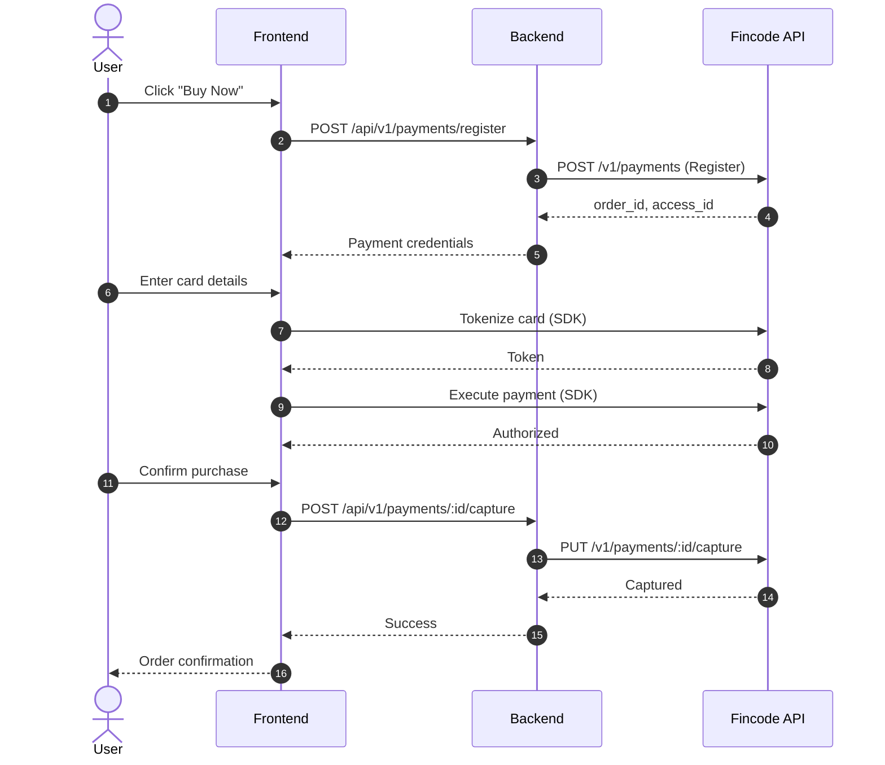
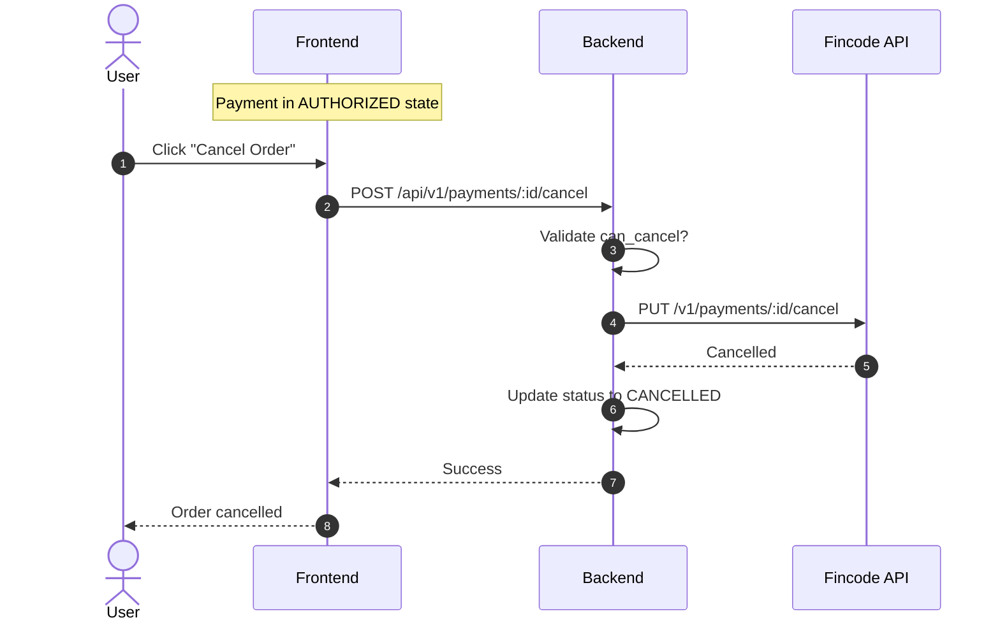
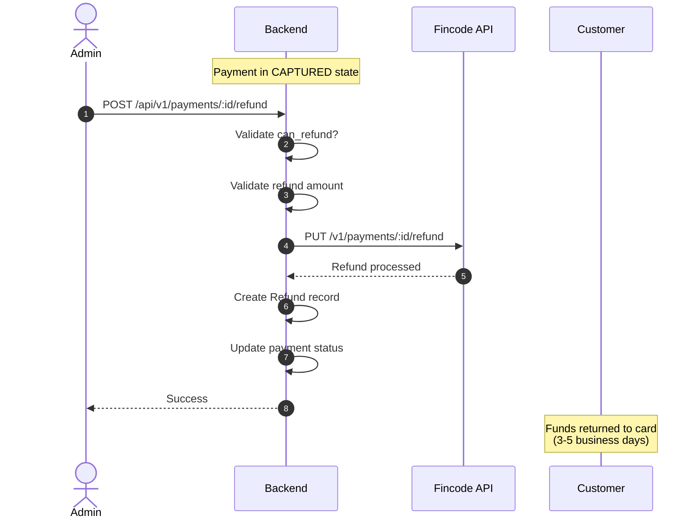

# Fincode Payment Integration - Complete Technical Documentation

This document provides comprehensive technical documentation for Fincode payment integration, covering all payment operations from registration through refund.

## Table of Contents
1. [Overview](#overview)
2. [Payment Operations](#payment-operations)
3. [Payment State Machine](#payment-state-machine)
4. [Complete Flow Diagrams](#complete-flow-diagrams)
5. [API Reference](#api-reference)
6. [Implementation Guide](#implementation-guide)
7. [Error Handling](#error-handling)
8. [Testing](#testing)

---

## Overview

### Design Goals
- **Streamlined Purchase**: Bypass traditional cart flow for direct purchases from product detail pages
- **Security First**: PCI DSS compliance through client-side tokenization
- **Flexible Cancellation**: Support cancellation before capture
- **Full Refund Support**: Both full and partial refunds for captured payments

### Two-Phase Payment Model

Fincode implements a **authorize-then-capture** model:

```
┌──────────────┐      ┌─────────────┐      ┌──────────────┐
│   REGISTER   │─────▶│  AUTHORIZE  │─────▶│   CAPTURE    │
│   (Backend)  │      │  (Frontend) │      │  (Backend)   │
└──────────────┘      └─────────────┘      └──────────────┘
                             │                      │
                             ▼                      ▼
                      ┌─────────────┐      ┌──────────────┐
                      │   CANCEL    │      │    REFUND    │
                      │  (Backend)  │      │  (Backend)   │
                      └─────────────┘      └──────────────┘
```

---

## Payment Operations

### 1. Register Payment

**Purpose**: Initialize payment session on Fincode

**When**: User confirms intent to purchase from product detail page

**Process**:
- Generate unique `order_id`
- Create payment record in local database (status: `PENDING`)
- Call Fincode API to register payment
- Return credentials for frontend SDK

**Fincode API**: `POST /v1/payments`

**Request**:
```json
{
  "pay_type": "Card",
  "job_code": "AUTH",
  "amount": "5000",
  "tax": "0",
  "id": "o_1234567890abcdef",
  "client_field_1": "user@example.com",
  "client_field_2": "John Doe"
}
```

**Response**:
```json
{
  "id": "o_1234567890abcdef",
  "access_id": "a_9876543210fedcba",
  "amount": 5000,
  "status": "UNPROCESSED"
}
```

---

### 2. Execute Payment (Authorization)

**Purpose**: Tokenize card and authorize payment

**When**: User submits card details on payment form

**Process**:
1. **Tokenize Card** (Frontend → Fincode)
   - Convert card details to secure token
   - Card data never touches application backend
   
2. **Execute Payment** (Frontend → Fincode)
   - Use token to authorize payment
   - Funds are reserved but not captured

**Important**: This operation is performed **entirely on the frontend** using Fincode SDK

**Frontend Implementation**:

```javascript
// Step 1: Tokenize Card
fincodeInstance.tokens(
  {
    card_no: '4111111111111111',
    expire: '2512',  // YYMM format
    holder_name: 'TARO YAMADA',
    security_code: '123'
  },
  function(status, response) {
    if (status === 200 || status === 201) {
      const token = response.id;
      // Proceed to step 2
      authorizePayment(token);
    } else {
      handleError(response.errors);
    }
  }
);

// Step 2: Execute Payment (Authorize)
function authorizePayment(token) {
  fincodeInstance.payments(
    {
      id: order_id,              // From register response
      pay_type: 'Card',
      access_id: access_id,      // From register response
      token: token,
      method: '1',               // 1: Lump sum payment
      card_no: card_number,
      expire: expire_date,
      holder_name: holder_name,
      security_code: cvv
    },
    function(status, response) {
      if (status === 200) {
        // Payment authorized - show confirmation screen
        showConfirmationScreen(response);
      } else {
        handleError(response.errors);
      }
    }
  );
}
```

**After Success**: Payment status becomes `AUTHORIZED` - funds are reserved but not yet charged

---

### 3. Confirm Payment

**Purpose**: Sync payment status after frontend authorization

**When**: After frontend successfully executes payment

**Process**:
- Verify payment exists
- Optionally validate with Fincode API
- Return current payment status to frontend

**Backend Endpoint**: `POST /api/v1/payments/:id/confirm`

**Implementation**:
```ruby
class ConfirmPaymentCommand < BaseCommand
  def execute
    payment = find_payment!
    
    # Payment status is already updated by Fincode
    # This endpoint just confirms and returns current state
    {
      payment_id: payment.id,
      status: payment.status,
      authorized_at: payment.authorized_at,
      amount: payment.amount
    }
  end
end
```

**Response**:
```json
{
  "success": true,
  "payment_id": 123,
  "status": "authorized",
  "authorized_at": "2026-01-19T09:00:00Z",
  "amount": 5000
}
```

---

### 4. Capture Payment

**Purpose**: Actually charge the customer's card

**When**: User confirms final purchase on confirmation screen

**Process**:
- Validate payment is in `AUTHORIZED` state
- Call Fincode Capture API
- Update local payment status to `CAPTURED`
- Create purchase record
- Reduce product inventory

**Backend Endpoint**: `POST /api/v1/payments/:id/capture`

**Fincode API**: `PUT /v1/payments/{id}/capture`

**Request to Fincode**:
```json
{
  "pay_type": "Card",
  "access_id": "a_9876543210fedcba",
  "amount": "5000"
}
```

**Implementation**:
```ruby
class CapturePaymentCommand < BaseCommand
  def execute
    payment = find_payment!
    validate_payment_status!(payment)
    
    # Call Fincode API
    result = fincode_service.capture(
      order_id: payment.fincode_order_id,
      access_id: payment.fincode_access_id,
      amount: payment.amount
    )
    
    # Update local database
    payment.update!(
      status: :captured,
      captured_at: Time.current
    )
    
    {
      payment_id: payment.id,
      status: payment.status,
      captured_at: payment.captured_at,
      amount: payment.amount
    }
  end
  
  private
  
  def validate_payment_status!(payment)
    unless payment.status == 'authorized'
      raise ValidationError, 'Payment must be authorized to capture'
    end
  end
end
```

**Response**:
```json
{
  "success": true,
  "payment_id": 123,
  "status": "captured",
  "captured_at": "2026-01-19T09:05:00Z",
  "amount": 5000,
  "message": "Payment captured successfully"
}
```

---

### 5. Cancel Payment

**Purpose**: Cancel an authorized payment before capture

**When**: 
- User cancels order before completion
- Admin cancels suspicious transaction
- Automatic timeout cancellation

**Restrictions**:
- Only `AUTHORIZED` payments can be cancelled
- Cannot cancel after capture (use refund instead)

**Backend Endpoint**: `POST /api/v1/payments/:id/cancel`

**Fincode API**: `PUT /v1/payments/{id}/cancel`

**Request to Fincode**:
```json
{
  "pay_type": "Card",
  "access_id": "a_9876543210fedcba"
}
```

**Implementation**:
```ruby
class CancelPaymentCommand < BaseCommand
  def execute
    payment = find_payment!
    validate_can_cancel!(payment)
    
    # Call Fincode API
    result = fincode_service.cancel(
      order_id: payment.fincode_order_id,
      access_id: payment.fincode_access_id
    )
    
    # Update local database
    payment.update!(
      status: :cancelled,
      canceled_at: Time.current
    )
    
    {
      payment_id: payment.id,
      status: payment.status,
      canceled_at: payment.canceled_at,
      amount: payment.amount
    }
  end
  
  private
  
  def validate_can_cancel!(payment)
    unless payment.can_cancel?
      raise ValidationError, 'Payment cannot be cancelled'
    end
  end
end

# Payment Model
class Payment < ApplicationRecord
  def can_cancel?
    authorized? && !captured? && !failed? && !cancelled?
  end
end
```

**Response**:
```json
{
  "success": true,
  "payment_id": 123,
  "status": "cancelled",
  "canceled_at": "2026-01-19T09:03:00Z",
  "amount": 5000,
  "message": "Payment cancelled successfully"
}
```

---

### 6. Refund Payment

**Purpose**: Return funds to customer after capture

**When**:
- Customer requests refund
- Product return/cancellation
- Merchant error correction

**Types**:
- **Full Refund**: Entire payment amount
- **Partial Refund**: Portion of payment amount

**Backend Endpoint**: `POST /api/v1/payments/:id/refund`

**Fincode API**: `PUT /v1/payments/{id}/refund`

**Request to Fincode** (Full Refund):
```json
{
  "pay_type": "Card",
  "access_id": "a_9876543210fedcba"
}
```

**Request to Fincode** (Partial Refund):
```json
{
  "pay_type": "Card",
  "access_id": "a_9876543210fedcba",
  "amount": "2000"
}
```

**Implementation**:
```ruby
class RefundPaymentCommand < BaseCommand
  attr_reader :payment_id, :amount, :reason, :current_user
  
  def initialize(payment_id:, current_user:, amount: nil, reason: nil)
    @payment_id = payment_id
    @amount = amount
    @reason = reason
    @current_user = current_user
  end
  
  def execute
    payment = find_payment!
    validate_can_refund!(payment)
    
    refund_amount = amount || payment.amount
    validate_refund_amount!(payment, refund_amount)
    
    # Call Fincode API
    refund_params = {
      order_id: payment.fincode_order_id,
      access_id: payment.fincode_access_id
    }
    refund_params[:amount] = refund_amount if amount.present?
    
    result = fincode_service.refund(**refund_params)
    
    # Create refund record
    refund = Refund.create!(
      payment: payment,
      amount: refund_amount,
      reason: reason,
      status: :completed,
      processed_by: current_user,
      processed_at: Time.current,
      fincode_refund_id: result['id']
    )
    
    # Update payment if fully refunded
    if fully_refunded?(payment, refund_amount)
      payment.update!(status: :refunded)
    end
    
    {
      refund_id: refund.id,
      payment_id: payment.id,
      amount: refund_amount,
      status: refund.status,
      remaining_amount: payment.amount - payment.refunds.sum(:amount)
    }
  end
  
  private
  
  def validate_can_refund!(payment)
    unless payment.captured?
      raise ValidationError, 'Only captured payments can be refunded'
    end
  end
  
  def validate_refund_amount!(payment, refund_amount)
    total_refunded = payment.refunds.sum(:amount)
    remaining = payment.amount - total_refunded
    
    if refund_amount > remaining
      raise ValidationError, "Refund amount exceeds remaining amount (¥#{remaining})"
    end
    
    if refund_amount <= 0
      raise ValidationError, 'Refund amount must be greater than 0'
    end
  end
  
  def fully_refunded?(payment, refund_amount)
    total_refunded = payment.refunds.sum(:amount) + refund_amount
    total_refunded >= payment.amount
  end
end
```

**Response**:
```json
{
  "success": true,
  "refund_id": 456,
  "payment_id": 123,
  "amount": 2000,
  "status": "completed",
  "remaining_amount": 3000,
  "message": "Refund processed successfully"
}
```

**Refund Database Schema**:
```ruby
create_table :refunds do |t|
  t.references :payment, null: false, foreign_key: true
  t.integer :amount, null: false
  t.text :reason
  t.string :status, null: false  # pending, completed, failed
  t.references :processed_by, foreign_key: { to_table: :users }
  t.datetime :processed_at
  t.string :fincode_refund_id
  t.timestamps
end
```

---

## Payment State Machine

### State Transition Diagram



### State Descriptions

| State | Description | Available Actions |
|-------|-------------|-------------------|
| `PENDING` | Payment registered, awaiting authorization | Execute, Expire |
| `AUTHORIZED` | Funds reserved on card | Capture, Cancel |
| `CAPTURED` | Payment complete, funds charged | Refund |
| `CANCELLED` | Authorization cancelled | None (terminal) |
| `FAILED` | Payment failed | None (terminal) |
| `PARTIALLY_REFUNDED` | Some funds returned | Refund (remaining) |
| `REFUNDED` | Fully refunded | None (terminal) |

### Business Rules

```ruby
class Payment < ApplicationRecord
  enum status: {
    pending: 'pending',
    authorized: 'authorized',
    captured: 'captured',
    failed: 'failed',
    cancelled: 'cancelled',
    partially_refunded: 'partially_refunded',
    refunded: 'refunded'
  }
  
  # Capture validation
  def can_capture?
    authorized? && !captured? && !failed? && !cancelled?
  end
  
  # Cancel validation
  def can_cancel?
    authorized? && !captured? && !failed? && !cancelled?
  end
  
  # Refund validation
  def can_refund?
    captured? || partially_refunded?
  end
  
  # Calculate refundable amount
  def refundable_amount
    return 0 unless can_refund?
    amount - refunds.sum(:amount)
  end
end
```

---

## Complete Flow Diagrams

### Happy Path: Successful Purchase



### Cancellation Flow



### Refund Flow



---

## API Reference

### Backend REST API Endpoints

| Method | Endpoint | Purpose | Auth Required |
|--------|----------|---------|---------------|
| POST | `/api/v1/payments/register` | Initialize payment | Yes |
| POST | `/api/v1/payments/:id/confirm` | Confirm authorization | Yes |
| POST | `/api/v1/payments/:id/capture` | Capture payment | Yes |
| POST | `/api/v1/payments/:id/cancel` | Cancel authorization | Yes |
| POST | `/api/v1/payments/:id/refund` | Issue refund | Yes (Admin) |
| GET | `/api/v1/payments/:id` | Get payment details | Yes |
| GET | `/api/v1/payments` | List payments | Yes |

### Fincode API Endpoints

| Method | Endpoint | Purpose |
|--------|----------|---------|
| POST | `/v1/payments` | Register payment |
| PUT | `/v1/payments/:id/execute` | Execute payment (alternative to SDK) |
| PUT | `/v1/payments/:id/capture` | Capture authorized payment |
| PUT | `/v1/payments/:id/cancel` | Cancel authorization |
| PUT | `/v1/payments/:id/refund` | Process refund |
| GET | `/v1/payments/:id` | Get payment status |

### Fincode Service Implementation

```ruby
module Fincode
  class PaymentService
    include HTTParty
    base_uri ENV['FINCODE_API_URL']
    
    def initialize
      @secret_key = ENV['FINCODE_SECRET_KEY']
      raise FincodeError, 'FINCODE_SECRET_KEY not configured' if @secret_key.blank?
    end
    
    # Register new payment
    def register(order_id:, amount:, customer_info: {})
      response = self.class.post(
        '/v1/payments',
        headers: headers,
        body: {
          pay_type: 'Card',
          job_code: 'AUTH',
          amount: amount.to_s,
          tax: '0',
          id: order_id,
          client_field_1: customer_info[:email],
          client_field_2: customer_info[:name]
        }.to_json
      )
      handle_response(response)
    end
    
    # Capture authorized payment
    def capture(order_id:, access_id:, amount:)
      response = self.class.put(
        "/v1/payments/#{order_id}/capture",
        headers: headers,
        body: {
          pay_type: 'Card',
          access_id: access_id.to_s,
          amount: amount.to_s
        }.to_json
      )
      handle_response(response)
    end
    
    # Cancel authorized payment
    def cancel(order_id:, access_id:)
      response = self.class.put(
        "/v1/payments/#{order_id}/cancel",
        headers: headers,
        body: {
          pay_type: 'Card',
          access_id: access_id.to_s
        }.to_json
      )
      handle_response(response)
    end
    
    # Refund captured payment
    def refund(order_id:, access_id:, amount: nil)
      body_data = {
        pay_type: 'Card',
        access_id: access_id.to_s
      }
      body_data[:amount] = amount.to_s if amount.present?
      
      response = self.class.put(
        "/v1/payments/#{order_id}/refund",
        headers: headers,
        body: body_data.to_json
      )
      handle_response(response)
    end
    
    # Get payment details
    def get_payment(order_id)
      response = self.class.get(
        "/v1/payments/#{order_id}?pay_type=Card",
        headers: headers
      )
      handle_response(response)
    end
    
    private
    
    def headers
      {
        'Content-Type' => 'application/json',
        'Authorization' => "Bearer #{@secret_key}"
      }
    end
    
    def handle_response(response)
      case response.code
      when 200, 201
        response.parsed_response
      when 400
        errors = parse_errors(response)
        Rails.logger.error("Fincode 400: #{errors}")
        raise FincodeError, "Bad Request: #{errors}"
      when 401
        Rails.logger.error("Fincode 401: Unauthorized")
        raise FincodeError, "Unauthorized - Check API credentials"
      when 404
        raise FincodeError, "Payment not found"
      else
        Rails.logger.error("Fincode #{response.code}: #{response.body}")
        raise FincodeError, "Payment processing failed (HTTP #{response.code})"
      end
    end
    
    def parse_errors(response)
      data = response.parsed_response
      return data['message'] if data.is_a?(Hash) && data['message']
      
      errors = data.is_a?(Hash) ? (data['errors'] || []) : []
      return errors.map { |e| e['error_message'] || e['message'] }.join(', ') if errors.any?
      
      'Unknown error'
    end
  end
end
```

---

## Implementation Guide

### Frontend Integration

#### Complete Payment Flow Component

```javascript
const PaymentFlow = () => {
  const [step, setStep] = useState('review');  // review, payment, processing, confirmed
  const [paymentData, setPaymentData] = useState(null);
  const [error, setError] = useState('');
  
  // Step 1: Register Payment
  const initializePayment = async () => {
    try {
      const response = await api.post('/api/v1/payments/register', {
        amount: totalAmount
      });
      
      const { order_id, access_id, public_key } = response.data;
      setPaymentData({ order_id, access_id, public_key });
      setStep('payment');
    } catch (err) {
      setError(err.message);
    }
  };
  
  // Step 2: Execute Payment (Tokenize + Authorize)
  const executePayment = async (cardDetails) => {
    setStep('processing');
    
    try {
      const fincodeInstance = window.Fincode(paymentData.public_key);
      
      // Tokenize card
      const token = await tokenizeCard(fincodeInstance, cardDetails);
      
      // Authorize payment
      await authorizePayment(fincodeInstance, token, cardDetails);
      
      setStep('confirmed');
    } catch (err) {
      setError(err.message);
      setStep('payment');
    }
  };
  
  // Step 3: Capture Payment
  const capturePayment = async () => {
    try {
      await api.post(`/api/v1/payments/${paymentData.order_id}/capture`);
      
      // Navigate to success page
      navigate(`/success/${paymentData.order_id}`);
    } catch (err) {
      setError(err.message);
    }
  };
  
  // Helper: Tokenize Card
  const tokenizeCard = (fincode, cardDetails) => {
    return new Promise((resolve, reject) => {
      fincode.tokens(
        {
          card_no: cardDetails.cardNumber.replace(/\s/g, ''),
          expire: formatExpiry(cardDetails.expiry),
          holder_name: cardDetails.holderName,
          security_code: cardDetails.cvv
        },
        (status, response) => {
          if (status === 200 || status === 201) {
            resolve(response.id);
          } else {
            reject(new Error(response.errors?.[0]?.message || 'Tokenization failed'));
          }
        }
      );
    });
  };
  
  // Helper: Authorize Payment
  const authorizePayment = (fincode, token, cardDetails) => {
    return new Promise((resolve, reject) => {
      fincode.payments(
        {
          id: paymentData.order_id,
          pay_type: 'Card',
          access_id: paymentData.access_id,
          token: token,
          method: '1',
          card_no: cardDetails.cardNumber.replace(/\s/g, ''),
          expire: formatExpiry(cardDetails.expiry),
          holder_name: cardDetails.holderName,
          security_code: cardDetails.cvv
        },
        (status, response) => {
          if (status === 200) {
            resolve(response);
          } else {
            reject(new Error(response.errors?.[0]?.message || 'Authorization failed'));
          }
        }
      );
    });
  };
  
  return (
    <div>
      {step === 'review' && <OrderReview onConfirm={initializePayment} />}
      {step === 'payment' && <PaymentForm onSubmit={executePayment} />}
      {step === 'processing' && <LoadingScreen />}
      {step === 'confirmed' && <ConfirmationScreen onCapture={capturePayment} />}
      {error && <ErrorMessage message={error} />}
    </div>
  );
};
```

### Backend Command Pattern

All payment operations follow a consistent command pattern:

```ruby
# Base Command
class BaseCommand
  def fincode_service
    @fincode_service ||= Fincode::PaymentService.new
  end
end

# Register Payment Command
class RegisterPaymentCommand < BaseCommand
  attr_reader :amount, :current_user
  
  def initialize(amount:, current_user:)
    @amount = amount
    @current_user = current_user
  end
  
  def execute
    validate_amount!
    
    order_id = generate_order_id
    
    # Call Fincode API
    result = fincode_service.register(
      order_id: order_id,
      amount: amount,
      customer_info: {
        email: current_user.email,
        name: current_user.name
      }
    )
    
    # Save to database
    payment = Payment.create!(
      fincode_order_id: order_id,
      fincode_access_id: result['access_id'],
      amount: amount,
      user: current_user,
      status: :pending
    )
    
    {
      order_id: payment.fincode_order_id,
      access_id: payment.fincode_access_id,
      amount: payment.amount,
      public_key: ENV['FINCODE_PUBLIC_KEY']
    }
  end
  
  private
  
  def validate_amount!
    raise ValidationError, 'Amount must be greater than 0' if amount <= 0
  end
  
  def generate_order_id
    "o_#{SecureRandom.hex(16)}"
  end
end
```

---

## Error Handling

### Error Categories

| Category | Description | User Action |
|----------|-------------|-------------|
| **Validation Error** | Invalid input data | Correct input and retry |
| **Card Error** | Card declined, insufficient funds | Try different card |
| **Network Error** | API timeout, connection failed | Retry operation |
| **State Error** | Invalid operation for current state | Contact support |
| **System Error** | Server error, service unavailable | Wait and retry |

### Common Error Codes

```ruby
module Fincode
  module ErrorCodes
    # Card Errors
    CARD_DECLINED = 'E01040001'
    INSUFFICIENT_FUNDS = 'E01040002'
    EXPIRED_CARD = 'E01040003'
    INVALID_CVV = 'E01040004'
    
    # Validation Errors
    INVALID_AMOUNT = 'E01010001'
    INVALID_CARD_NUMBER = 'E01010002'
    
    # State Errors
    ALREADY_CAPTURED = 'E01020001'
    ALREADY_CANCELLED = 'E01020002'
    CANNOT_REFUND = 'E01020003'
    
    # System Errors
    API_ERROR = 'E01030001'
    NETWORK_ERROR = 'E01030002'
  end
end
```

### Error Response Format

```json
{
  "success": false,
  "error": {
    "code": "E01040001",
    "message": "Card was declined",
    "field": "card_no",
    "type": "card_error"
  }
}
```

### Frontend Error Handling

```javascript
const handlePaymentError = (error) => {
  const errorTypes = {
    card_error: {
      title: 'Card Error',
      action: 'Please try a different payment method',
      severity: 'warning'
    },
    validation_error: {
      title: 'Invalid Information',
      action: 'Please check your information and try again',
      severity: 'info'
    },
    network_error: {
      title: 'Connection Error',
      action: 'Please check your connection and retry',
      severity: 'error'
    },
    system_error: {
      title: 'System Error',
      action: 'Please contact support',
      severity: 'error'
    }
  };
  
  const errorConfig = errorTypes[error.type] || errorTypes.system_error;
  
  showNotification({
    title: errorConfig.title,
    message: error.message,
    action: errorConfig.action,
    severity: errorConfig.severity
  });
};
```

---

## Testing

### Test Cards (from Fincode Documentation)

| Card Brand | Card Number | Expiry | CVV | Expected Result |
|------------|-------------|--------|-----|-----------------|
| Visa | 4111111111111111 | Any future | Any 3 digits | Success |
| Visa | 4242424242424242 | Any future | Any 3 digits | 3D Secure test |
| Mastercard | 5555555555554444 | Any future | Any 3 digits | Success |
| JCB | 3566111111111113 | Any future | Any 3 digits | Success |

### Test Scenarios

#### 1. Happy Path Test
```ruby
RSpec.describe 'Payment Flow', type: :request do
  it 'completes full payment cycle' do
    # Register
    post '/api/v1/payments/register', params: { amount: 5000 }
    expect(response).to have_http_status(:success)
    payment_data = JSON.parse(response.body)
    
    # Simulate frontend authorization
    payment = Payment.find_by(fincode_order_id: payment_data['order_id'])
    payment.update!(status: :authorized)
    
    # Capture
    post "/api/v1/payments/#{payment_data['order_id']}/capture"
    expect(response).to have_http_status(:success)
    
    payment.reload
    expect(payment.status).to eq('captured')
  end
end
```

#### 2. Cancellation Test
```ruby
it 'cancels authorized payment' do
  payment = create(:payment, status: :authorized)
  
  post "/api/v1/payments/#{payment.fincode_order_id}/cancel"
  expect(response).to have_http_status(:success)
  
  payment.reload
  expect(payment.status).to eq('cancelled')
end
```

#### 3. Refund Test
```ruby
it 'processes partial refund' do
  payment = create(:payment, status: :captured, amount: 5000)
  
  post "/api/v1/payments/#{payment.fincode_order_id}/refund", 
    params: { amount: 2000, reason: 'Customer request' }
  
  expect(response).to have_http_status(:success)
  expect(payment.refunds.sum(:amount)).to eq(2000)
  expect(payment.refundable_amount).to eq(3000)
end
```

### Integration Test Checklist

- [ ] Register payment with valid amount
- [ ] Register payment with invalid amount (should fail)
- [ ] Tokenize card with valid details
- [ ] Tokenize card with invalid card number (should fail)
- [ ] Execute payment with valid token
- [ ] Execute payment with invalid token (should fail)
- [ ] Capture authorized payment
- [ ] Attempt to capture already captured payment (should fail)
- [ ] Cancel authorized payment
- [ ] Attempt to cancel captured payment (should fail)
- [ ] Process full refund
- [ ] Process partial refund
- [ ] Attempt to refund more than available (should fail)
- [ ] Verify inventory reduction on capture
- [ ] Verify idempotency of operations

---

## Security Considerations

### PCI DSS Compliance

✅ **Card data never touches backend**
- Tokenization happens client-side via Fincode SDK
- Only tokens are transmitted to application servers

✅ **HTTPS enforcement**
- All API calls use TLS 1.2+
- Certificate pinning recommended for mobile apps

✅ **API key security**
- Public key for frontend (read-only operations)
- Secret key for backend (write operations)
- Keys stored in environment variables, never in code

### Rate Limiting

```ruby
# config/initializers/rack_attack.rb
class Rack::Attack
  throttle('payments/register', limit: 5, period: 1.minute) do |req|
    if req.path == '/api/v1/payments/register' && req.post?
      req.ip
    end
  end
  
  throttle('payments/capture', limit: 10, period: 1.minute) do |req|
    if req.path.match?(%r{/api/v1/payments/.*/capture}) && req.post?
      req.ip
    end
  end
end
```

### Audit Logging

```ruby
class Payment < ApplicationRecord
  after_update :log_status_change
  
  private
  
  def log_status_change
    if saved_change_to_status?
      PaymentAuditLog.create!(
        payment: self,
        previous_status: status_before_last_save,
        new_status: status,
        changed_by: Current.user,
        ip_address: Current.ip_address,
        user_agent: Current.user_agent
      )
    end
  end
end
```

---

## Monitoring & Observability

### Key Metrics

| Metric | Description | Alert Threshold |
|--------|-------------|-----------------|
| `payment.success_rate` | Successful captures / Total attempts | < 95% |
| `payment.avg_duration` | Average time from register to capture | > 5 minutes |
| `payment.refund_rate` | Refunds / Total captures | > 5% |
| `payment.cancellation_rate` | Cancellations / Authorizations | > 15% |

### Logging Best Practices

```ruby
class CapturePaymentCommand < BaseCommand
  def execute
    Rails.logger.info(
      "Payment capture initiated",
      payment_id: payment.id,
      order_id: payment.fincode_order_id,
      amount: payment.amount,
      user_id: current_user.id
    )
    
    # ... capture logic ...
    
    Rails.logger.info(
      "Payment captured successfully",
      payment_id: payment.id,
      duration_ms: duration
    )
  rescue => e
    Rails.logger.error(
      "Payment capture failed",
      payment_id: payment.id,
      error: e.message,
      backtrace: e.backtrace.first(5)
    )
    raise
  end
end
```

---

## Appendix

### Database Migration

```ruby
class CreatePaymentsAndRefunds < ActiveRecord::Migration[7.0]
  def change
    create_table :payments do |t|
      t.references :user, null: true, foreign_key: true
      t.references :order, null: true, foreign_key: true
      
      t.string :fincode_order_id, null: false, index: { unique: true }
      t.string :fincode_access_id, null: false
      t.integer :amount, null: false
      
      t.string :status, null: false, default: 'pending'
      t.datetime :authorized_at
      t.datetime :captured_at
      t.datetime :canceled_at
      
      t.string :card_last4
      t.text :error_message
      
      t.timestamps
    end
    
    create_table :refunds do |t|
      t.references :payment, null: false, foreign_key: true
      t.references :processed_by, foreign_key: { to_table: :users }
      
      t.integer :amount, null: false
      t.text :reason
      t.string :status, null: false, default: 'pending'
      t.string :fincode_refund_id
      t.datetime :processed_at
      
      t.timestamps
    end
    
    add_index :payments, :status
    add_index :refunds, :status
  end
end
```

### Environment Variables

```bash
# .env
FINCODE_API_URL=https://api.fincode.jp
FINCODE_PUBLIC_KEY=p_test_XXXxxxXXXxxx
FINCODE_SECRET_KEY=s_test_XXXxxxXXXxxx

# Production
# FINCODE_API_URL=https://api.fincode.jp
# FINCODE_PUBLIC_KEY=p_live_XXXxxxXXXxxx
# FINCODE_SECRET_KEY=s_live_XXXxxxXXXxxx
```

### References

- [Fincode API Documentation](https://docs.fincode.jp/api#tag/%E6%B1%BA%E6%B8%88/operation/)
- [Fincode Test Cards](https://docs.fincode.jp/payment/note)
- [Fincode Refund Mechanisms](https://docs.fincode.jp/develop_support/test_resources)
- [PCI DSS Compliance Guide](https://www.pcisecuritystandards.org/)

---

**Document Version**: 2.0  
**Last Updated**: 2026-01-19  
**Maintained By**: Engineering Team
