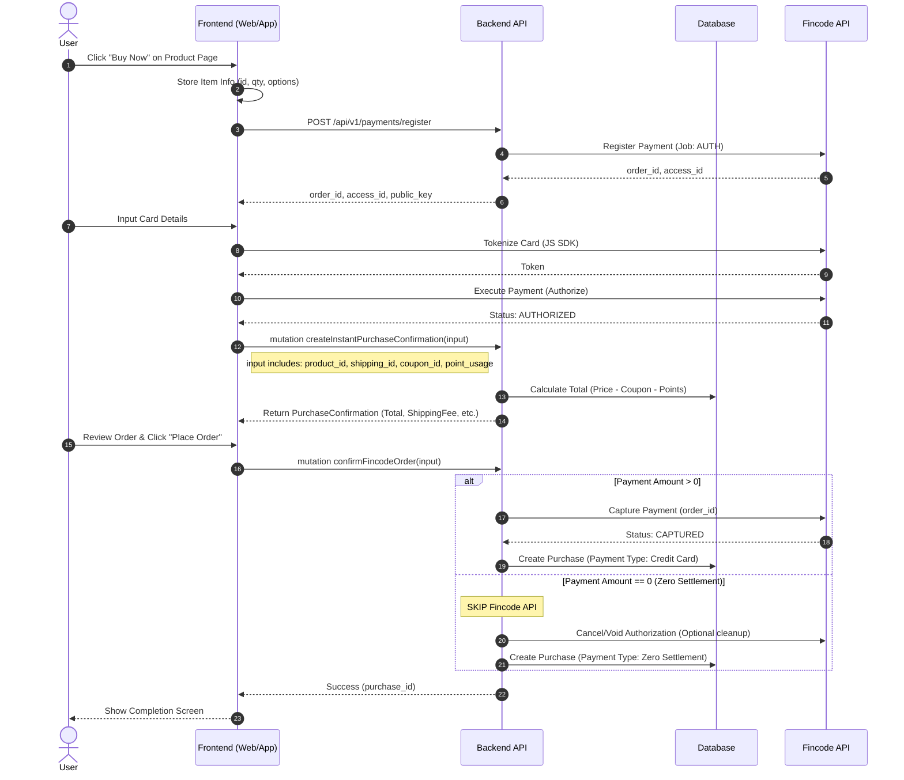

# Fincode Payment Integration - Direct Purchase Flow

This document outlines the technical implementation for the **Direct Purchase (Instant Buy)** flow using Fincode, bypassing the traditional shopping cart. This design aims to maximize conversion rates by minimizing steps between product viewing and purchase completion.

## Table of Contents
1. [Overview & Design Goals](#overview--design-goals)
2. [Direct Purchase Architecture](#direct-purchase-architecture)
3. [Zero Settlement Logic](#zero-settlement-logic)
4. [GraphQL API Reference](#graphql-api-reference)
5. [Payment Operations (Backend)](#payment-operations-backend)
6. [Refund Flow (Frontend-Driven)](#refund-flow-frontend-driven)
7. [Database Schema](#database-schema)

---

## Overview & Design Goals

### Objective
Implement a "Buy Now" button on the **Product Detail Page** that allows users to purchase the specific item immediately, bypassing the general cart (`/carts/line_items`).

### Key Features
- **Instant Flow**: Product Page -> Payment Input -> Confirmation -> Complete.
- **Client-Side Storage**: Temporarily store purchase intent (product_id, quantity, options) on the client during the flow.
- **GraphQL API**: Use GraphQL mutations for instant purchase confirmation and order finalization.
- **Zero-Amount Handling**: Automatically handle 0 Yen transactions (points/coupons) without calling Fincode API.
- **Frontend-Driven Refund**: Frontend SDK handles refund execution; Backend records the result.

---

## Direct Purchase Architecture

### Flow Overview

1.  **Product Page**: User clicks "Buy Now" (Fincode Pay).
2.  **Initialization**: Client stores item data temporarily.
3.  **Payment Registration**: Client calls Server to Register Payment (`POST /api/v1/payments/register`).
4.  **Fincode Authorization**:
    *   Client uses Fincode JS SDK to Tokenize Card.
    *   Client uses Fincode JS SDK to Authorize Payment (`execute`).
5.  **Purchase Confirmation (GraphQL)**:
    *   Client calls `mutation createInstantPurchaseConfirmation`.
    *   Server validates stock, calculates totals (including coupons/points), and returns display info.
    *   **Zero Settlement Check**: If total is 0, Fincode auth is skipped/voided conceptually (handled in next step).
6.  **Order Finalization (GraphQL)**:
    *   Client calls `mutation confirmFincodeOrder`.
    *   Server validates transaction status.
    *   **If > 0 Yen**: Server calls `Capture Payment` to Fincode.
    *   **If 0 Yen**: Server skips Fincode capture, records "Zero Settlement" purchase.
    *   Server creates `Purchase` record.
7.  **Completion**: Server returns purchase ID; Client shows Thank You page.

### Sequence Diagram



---

## Zero Settlement Logic

### Rule
**Fincode API is NOT called for 0 Yen transactions.**

If the final payment amount (after coupons and points) is **0 Yen**:
1.  **Payment Type** becomes `zero_settlement` (12).
2.  **API Call**: Server **skips** the `Capture` call to Fincode.
3.  **Cleanup**: Ideally, the server should `Cancel` the previously Authorized Fincode transaction to release the authorization hold on the user's card.

### Server Implementation Logic (Pseudo-code)

```ruby
def confirm_order(fincode_order_id, purchase_params)
  # 1. Calculate final amount
  total_amount = calculate_total(purchase_params) # Price + Shipping - Coupon - Point

  if total_amount == 0
    # ZERO SETTLEMENT FLOW
    # a. Create Purchase with type 'zero_settlement'
    purchase = create_zero_settlement_purchase(purchase_params)
    
    # b. Cancel the Fincode Auth (since we won't capture it)
    payment = Payment.find_by(fincode_order_id: fincode_order_id)
    Fincode::PaymentService.new.cancel(payment.id) if payment
    
    return purchase
  else
    # STANDARD FINCODE FLOW
    # a. Capture Fincode Payment
    payment = Payment.find_by(fincode_order_id: fincode_order_id)
    PaymentService.new.capture(payment.id)
    
    # b. Create Purchase
    create_fincode_purchase(purchase_params)
  end
end
```

---

## GraphQL API Reference

### 1. `createInstantPurchaseConfirmation`
Preview the purchase details before finalizing.

```graphql
input CreateInstantPurchaseConfirmationInput {
  # Item Details (Single item for now, array for future proofing)
  lineItems: [InstantPurchaseLineItem!]!
  
  # Fincode Order Context
  fincodeOrderId: String!
  
  # User Selections
  couponId: Int
  usePoints: Int
  shippingAddressId: Int
}

input InstantPurchaseLineItem {
  productId: String!
  quantity: Int!
  customItemIds: [Int!]
}

type PurchaseConfirmationPayload {
  purchaseConfirmation: PurchaseConfirmationType!
}

type PurchaseConfirmationType {
  totalAmount: Int!
  subTotal: Int!
  shippingFee: Int!
  discountAmount: Int! # Points + Coupon
  
  # List of usable coupons for UI selection
  coupons: [CouponType!] 
}
```

### 2. `confirmFincodeOrder`
Finalize the purchase and capture payment.

```graphql
input ConfirmFincodeOrderInput {
  fincodeOrderId: String!
  
  # Final confirmation of inputs to ensure consistency
  lineItems: [InstantPurchaseLineItem!]!
  couponId: Int
  usePoints: Int
  shippingAddressId: Int
}

type ConfirmFincodeOrderPayload {
  purchaseId: ID!
  status: String!     # "completed"
  paymentType: String! # "fincode" or "zero_settlement"
}
```

---

## Payment Operations (Backend)

### 1. Register Payment
*   **Endpoint**: `POST /api/v1/payments/register`
*   **Purpose**: Create `order_id` and `access_id` for Frontend SDK.
*   **Context**: Called when user enters Product Detail flow.

### 2. Capture Payment (Backend Command)
*   **Triggered By**: `confirmFincodeOrder` mutation (Server-side).
*   **Condition**: Only executed if `amount > 0`.
*   **Logic**:
    *   Validate Payment is `AUTHORIZED`.
    *   Call Fincode Capture API.
    *   Update DB: `status: captured`.

### 3. Cancel Payment
*   **Triggered By**: Zero settlement flow OR User cancellation.
*   **Purpose**: Void the Authorization to release funds.

---

## Refund Flow (Frontend-Driven)

**Changes from previous design**: Refund execution is handled by the **Frontend (FE)** using the Fincode SDK/API directly (or through a proxy that FE controls), and the Backend simply records the result.

### Flow
1.  **Frontend**: Calls Fincode SDK/API to execute refund.
2.  **Frontend**: Receives success response (with `refund_id`).
3.  **Frontend**: Calls Backend API `POST /api/v1/payments/:id/refund`.
4.  **Backend**: Records the refund in database.

### API Endpoint: `POST /api/v1/payments/:id/refund`

**Parameters**:
*   `amount` (Integer, Optional): Refund amount.
*   `reason` (String, Optional): Reason for refund.
*   `fincode_refund_id` (String, **Required for this flow**): The ID returned by Fincode SDK.

**Backend Logic (`RefundPaymentCommand`)**:
```ruby
def execute
  # 1. Validate Payment State
  payment = find_payment!
  validate_can_refund!(payment)

  # 2. Logic Branch
  if fincode_refund_id.present?
    # A. Frontend-Driven: Just record it
    actual_refund_id = fincode_refund_id
  else
    # B. Backend-Driven (Fallback/Admin): Call API
    result = fincode_service.refund(...)
    actual_refund_id = result['id']
  end

  # 3. Create Record
  Refund.create!(
    payment: payment,
    amount: amount,
    fincode_refund_id: actual_refund_id,
    status: :completed
  )
  
  # 4. Update Payment Status
  update_payment_status!(payment)
end
```

---

## Database Schema

### `payments`
Tracks the lifecycle of the Fincode transaction.

| Column | Type | Description |
|--------|------|-------------|
| `fincode_order_id` | String | Unique ID for Fincode |
| `fincode_access_id` | String | Auth token for Fincode SDK |
| `status` | Enum | `pending`, `authorized`, `captured`, `cancelled`, `refunded` |
| `amount` | Integer | Transaction amount |

### `refunds`
Tracks refund history.

| Column | Type | Description |
|--------|------|-------------|
| `payment_id` | FK | Link to Payment |
| `fincode_refund_id` | String | ID from Fincode |
| `amount` | Integer | Refund amount |
| `status` | String | `completed` |

---

## Implementation Checklist

- [ ] **Frontend**: Implement "Buy Now" button on Product Page.
- [ ] **Frontend**: Implement temporary storage for instant purchase items.
- [ ] **Backend (GraphQL)**: Implement `createInstantPurchaseConfirmation`.
- [ ] **Backend (GraphQL)**: Implement `confirmFincodeOrder`.
- [ ] **Backend**: Implement logic to skip Fincode Capture if total is 0.
- [ ] **Backend**: Ensure `RefundPaymentCommand` supports `fincode_refund_id` param.
- [ ] **Testing**: Verify flow for Normal Purchase (>0) and Zero Settlement (0).
