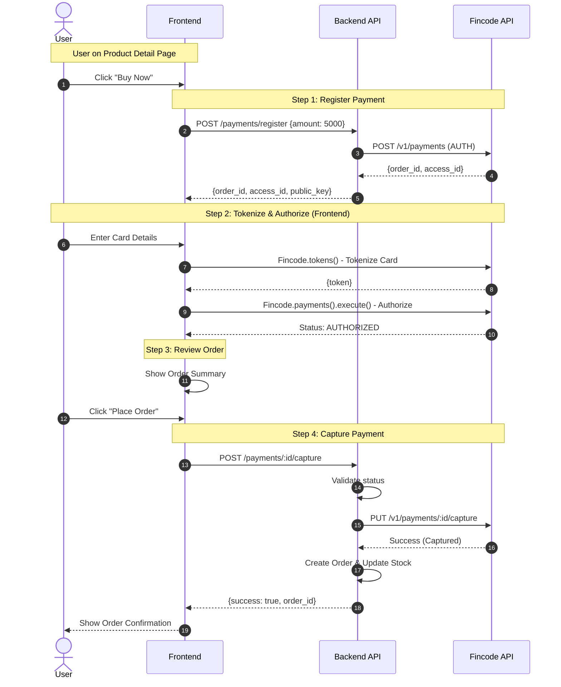
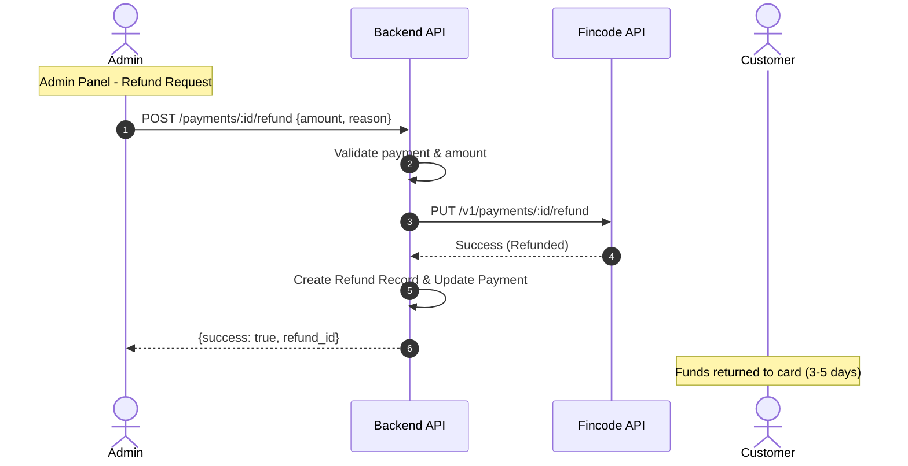
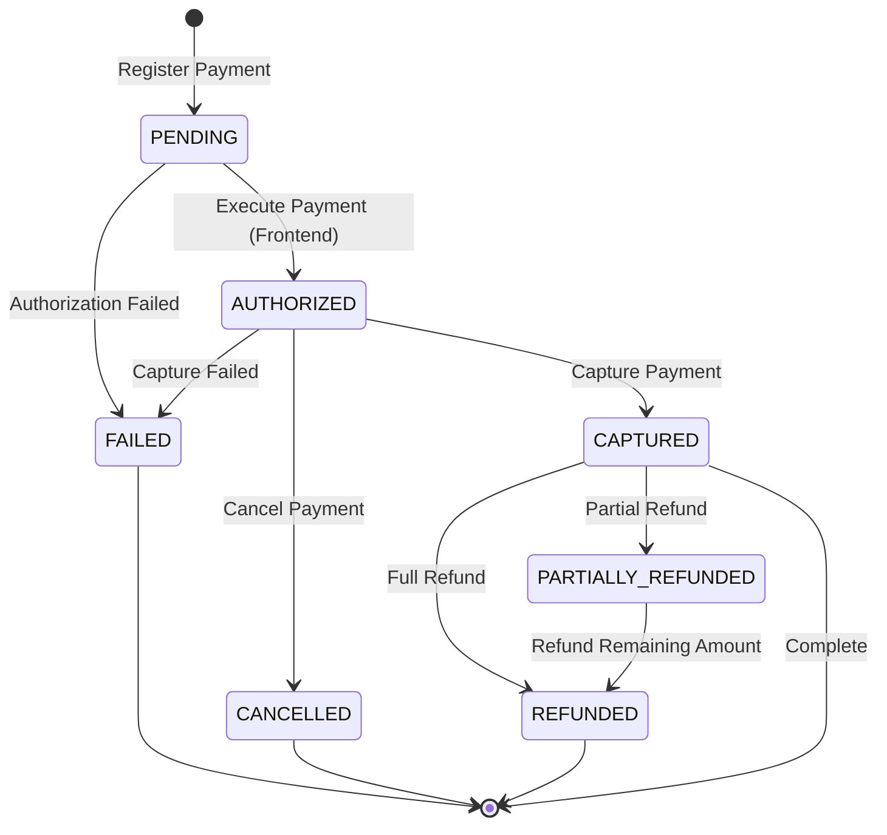

# Fincode Payment - Technical Documentation

**Last Updated**: 2026-01-19  
**Payment Provider**: Fincode

---

## Table of Contents

1. [Quick Start](#quick-start)
2. [Overview](#overview)
3. [Payment Flow](#payment-flow)
4. [Implementation Guide](#implementation-guide)
5. [API Reference](#api-reference)
6. [Testing](#testing)
7. [Production Deployment](#production-deployment)
8. [Fincode Reference](#fincode-reference)

---

## Quick Start

### Environment Setup

```bash
# Development
FINCODE_API_URL=https://api.test.fincode.jp
FINCODE_SECRET_KEY=sk_test_...
FINCODE_PUBLIC_KEY=pk_test_...

# Production
FINCODE_API_URL=https://api.fincode.jp
FINCODE_SECRET_KEY=sk_live_...
FINCODE_PUBLIC_KEY=pk_live_...
```

### Test Card

```
Card Number: 4111111111111111
Expiry: 2512 (YYMM)
CVV: 123
Holder: TARO YAMADA
```

### Basic Flow

1. **Register Payment** → Backend creates payment session
2. **Tokenize Card** → Frontend converts card to token (PCI safe)
3. **Execute Payment** → Frontend authorizes with token
4. **Capture Payment** → Backend charges the card

---

## Overview

### Design Goals

- ✅ **Streamlined Purchase**: Direct purchases from product detail pages
- ✅ **Security First**: PCI DSS compliance through client-side tokenization
- ✅ **Flexible Operations**: Support for capture, cancel, and refund
- ✅ **Multi-Gateway Ready**: Abstracted gateway interface for future providers
- ✅ **Clean Architecture**: Service Layer with Strategy Pattern

### Payment Model

Fincode uses an **authorize-then-capture** model:

```
┌──────────────┐      ┌─────────────┐      ┌─────────────┐      ┌──────────────┐
│   REGISTER   │─────▶│  TOKENIZE   │─────▶│   EXECUTE   │─────▶│   CAPTURE    │
│   (Backend)  │      │  (Frontend) │      │  (Frontend) │      │  (Backend)   │
│              │      │             │      │             │      │              │
│ Create       │      │ Card → Token│      │ Authorize   │      │ Charge Card  │
│ Payment      │      │ (PCI Safe)  │      │ Payment     │      │ Complete     │
└──────────────┘      └─────────────┘      └─────────────┘      └──────────────┘
                                                   │                      │
                                                   ▼                      ▼
                                            ┌─────────────┐      ┌──────────────┐
                                            │   CANCEL    │      │    REFUND    │
                                            │  (Backend)  │      │  (Backend)   │
                                            │             │      │              │
                                            │ Release Hold│      │ Return Funds │
                                            └─────────────┘      └──────────────┘
```

**Key Operations**:
1. **Register** (Backend): Create payment session on Fincode
2. **Tokenize** (Frontend): Convert card details to secure token
3. **Execute** (Frontend): Authorize payment - funds reserved but not charged
4. **Capture** (Backend): Actually charge the card
5. **Cancel** (Backend): Release authorization before capture
6. **Refund** (Backend): Return funds after capture

---

## Payment Flow

### End-to-End Payment Flow



### Refund Flow



### Payment State Machine



**State Descriptions**:

| State | Description | Available Actions |
|-------|-------------|-------------------|
| `PENDING` | Payment registered, awaiting authorization | Execute, Expire |
| `AUTHORIZED` | Funds reserved on card | Capture, Cancel |
| `CAPTURED` | Payment complete, funds charged | Refund |
| `CANCELLED` | Authorization cancelled | None (terminal) |
| `FAILED` | Payment failed | None (terminal) |
| `PARTIALLY_REFUNDED` | Some funds returned | Refund (remaining) |
| `REFUNDED` | Fully refunded | None (terminal) |

---

## Implementation Guide

### Architecture Overview

```
┌─────────────────────────────────────────────────────────┐
│                    Controllers                          │
│              (API/V1::PaymentsController)               │
└────────────────────┬────────────────────────────────────┘
                     │
┌────────────────────▼────────────────────────────────────┐
│                 Service Layer                           │
│            (Payments::PaymentService)                   │
│  • Business logic orchestration                         │
│  • Validation                                           │
│  • Database operations                                  │
└────────────────────┬────────────────────────────────────┘
                     │
┌────────────────────▼────────────────────────────────────┐
│              Gateway Layer (Strategy Pattern)           │
│         (Payments::Gateways::BaseGateway)               │
│                        │                                │
│         ┌──────────────┴──────────────┐                │
│         ▼                              ▼                │
│  FincodeGateway              StripeGateway (future)     │
└────────────────────┬────────────────────────────────────┘
                     │
┌────────────────────▼────────────────────────────────────┐
│              HTTP Client Layer                          │
│       (Payments::Gateways::FincodeClient)               │
│  • Low-level API communication                          │
│  • Error handling                                       │
│  • Response parsing                                     │
└─────────────────────────────────────────────────────────┘
```

### Key Components

#### 1. PaymentService (Service Layer)

```ruby
module Payments
  class PaymentService
    attr_reader :current_user, :gateway

    def initialize(current_user, gateway: nil)
      @current_user = current_user
      @gateway = gateway || Payments::Gateways::FincodeGateway.new
    end

    def register_payment(amount:)
      validate_amount!(amount)
      
      result = gateway.register(amount: amount, user: current_user)
      
      payment = Payment.create!(
        user: current_user,
        fincode_order_id: result[:id],
        fincode_access_id: result[:access_id],
        amount: amount,
        status: :authorized
      )

      {
        order_id: payment.fincode_order_id,
        access_id: payment.fincode_access_id,
        amount: payment.amount,
        public_key: ENV.fetch('FINCODE_PUBLIC_KEY')
      }
    end

    def capture_payment(payment_id:)
      payment = find_payment!(payment_id)
      validate_can_capture!(payment)

      gateway.capture(
        order_id: payment.fincode_order_id,
        access_id: payment.fincode_access_id,
        amount: payment.amount
      )

      payment.update!(status: :captured, captured_at: Time.current)

      {
        payment_id: payment.id,
        status: payment.status,
        amount: payment.amount
      }
    end

    # ... other methods
  end
end
```

#### 2. Gateway Interface

```ruby
module Payments
  module Gateways
    class BaseGateway
      def register(amount:, user:)
        raise NotImplementedError
      end

      def capture(order_id:, access_id:, amount:)
        raise NotImplementedError
      end

      def cancel(order_id:, access_id:)
        raise NotImplementedError
      end

      def refund(order_id:, access_id:, amount:)
        raise NotImplementedError
      end
    end
  end
end
```

#### 3. FincodeGateway Implementation

```ruby
module Payments
  module Gateways
    class FincodeGateway < BaseGateway
      def initialize(fincode_client = nil)
        @fincode_client = fincode_client || FincodeClient.new
      end

      def register(amount:, user:)
        order_id = generate_order_id
        
        result = handle_errors do
          @fincode_client.register(
            order_id: order_id,
            amount: amount,
            customer_info: {
              email: user.email,
              name: user.display_name
            }
          )
        end

        {
          id: result['id'],
          access_id: result['access_id'],
          amount: amount
        }
      end

      private

      def handle_errors
        yield
      rescue FincodeClient::FincodeError => e
        raise Payments::Error, e.message
      end

      def generate_order_id
        "ORD_#{Time.current.to_i}_#{SecureRandom.hex(6)}"
      end
    end
  end
end
```

### Error Handling

#### Centralized Error Handling

```ruby
# app/services/payments.rb
module Payments
  class Error < StandardError; end
  class ValidationError < Error; end
  class NotFoundError < Error; end
end

# app/controllers/application_controller.rb
class ApplicationController < ActionController::API
  rescue_from Payments::NotFoundError, with: :render_payment_not_found
  rescue_from Payments::ValidationError, with: :render_payment_validation_error
  rescue_from Payments::Error, with: :render_payment_error

  private

  def render_payment_not_found(exception)
    render json: { success: false, error: exception.message }, status: :not_found
  end

  def render_payment_validation_error(exception)
    render json: { success: false, error: exception.message }, status: :unprocessable_entity
  end

  def render_payment_error(exception)
    render json: { success: false, error: exception.message }, status: :unprocessable_entity
  end
end
```

### Database Schema

```ruby
# Payments Table
create_table :payments do |t|
  t.references :user, foreign_key: true
  t.string :fincode_order_id, null: false, index: { unique: true }
  t.string :fincode_access_id, null: false
  t.integer :amount, null: false
  t.string :status, default: 'pending', null: false
  t.string :customer_email
  t.datetime :authorized_at
  t.datetime :captured_at
  t.datetime :canceled_at
  t.timestamps
end

# Refunds Table
create_table :refunds do |t|
  t.references :payment, null: false, foreign_key: true
  t.references :processed_by, foreign_key: { to_table: :users }
  t.integer :amount, null: false
  t.text :reason
  t.string :status, default: 'pending', null: false
  t.string :fincode_refund_id
  t.datetime :processed_at
  t.timestamps
end
```

### Business Rules

```ruby
class Payment < ApplicationRecord
  enum status: {
    pending: 'pending',
    authorized: 'authorized',
    captured: 'captured',
    failed: 'failed',
    cancelled: 'cancelled',
    partially_refunded: 'partially_refunded',
    refunded: 'refunded'
  }
  
  def can_capture?
    authorized? && !captured? && !failed? && !cancelled?
  end
  
  def can_cancel?
    authorized? && !captured? && !failed? && !cancelled?
  end
  
  def can_refund?
    captured? || partially_refunded?
  end
  
  def refundable_amount
    return 0 unless can_refund?
    amount - refunds.completed.sum(:amount)
  end
end
```

---

## API Reference

### Backend REST API

| Method | Endpoint | Purpose | Auth Required |
|--------|----------|---------|---------------|
| POST | `/api/v1/payments/register` | Initialize payment | Yes |
| POST | `/api/v1/payments/:id/confirm` | Confirm authorization | Yes |
| POST | `/api/v1/payments/:id/capture` | Capture payment | Yes |
| POST | `/api/v1/payments/:id/cancel` | Cancel authorization | Yes |
| POST | `/api/v1/payments/:id/refund` | Issue refund | Yes |
| GET | `/api/v1/payments/:id` | Get payment details | Yes |
| GET | `/api/v1/payments` | List payments | Yes |

### Fincode API Endpoints

| Method | Endpoint | Purpose |
|--------|----------|---------|
| POST | `/v1/payments` | Register payment |
| PUT | `/v1/payments/:id/capture` | Capture authorized payment |
| PUT | `/v1/payments/:id/cancel` | Cancel authorization |
| PUT | `/v1/payments/:id/refund` | Process refund |

### Request/Response Examples

#### Register Payment

**Request**:
```http
POST /api/v1/payments/register
Content-Type: application/json
Authorization: Bearer {access_token}

{
  "amount": 5000
}
```

**Response**:
```json
{
  "success": true,
  "order_id": "ORD_1737273600_a1b2c3d4e5f6",
  "access_id": "a_9876543210fedcba",
  "amount": 5000,
  "public_key": "pk_test_..."
}
```

#### Capture Payment

**Request**:
```http
POST /api/v1/payments/:id/capture
Authorization: Bearer {access_token}
```

**Response**:
```json
{
  "success": true,
  "payment_id": 123,
  "status": "captured",
  "captured_at": "2026-01-19T09:05:00Z",
  "amount": 5000,
  "message": "Payment captured successfully"
}
```

#### Refund Payment

**Request**:
```http
POST /api/v1/payments/:id/refund
Content-Type: application/json
Authorization: Bearer {access_token}

{
  "amount": 2000,
  "reason": "Customer requested refund"
}
```

**Response**:
```json
{
  "success": true,
  "refund_id": 456,
  "payment_id": 123,
  "amount": 2000,
  "status": "completed",
  "remaining_amount": 3000,
  "message": "Refund processed successfully"
}
```

---

## Testing

### Test Cards

#### Success Cases

| Card Brand | Card Number | Expiry | CVV | Result |
|------------|-------------|--------|-----|--------|
| VISA | `4111111111111111` | `2512` | `123` | Success |
| MasterCard | `5555555555554444` | `2512` | `123` | Success |
| JCB | `3566111111111113` | `2512` | `123` | Success |
| Amex | `378282246310005` | `2512` | `1234` | Success |

#### Error Cases

| Card Number | Expected Error |
|-------------|----------------|
| `4000000000000002` | Card declined |
| `4000000000000069` | Expired card |
| `4000000000000127` | Incorrect CVV |
| `4000000000000119` | Processing error |

**Format Notes**:
- Expiry: `YYMM` (e.g., `2512` = December 2025)
- Holder: Any valid name (e.g., `TARO YAMADA`)
- CVV: 3 digits (4 for Amex)

---

### Environment Configuration

```bash
# Production
FINCODE_API_URL=https://api.fincode.jp
FINCODE_SECRET_KEY=sk_live_...
FINCODE_PUBLIC_KEY=pk_live_...

# Monitoring
SENTRY_DSN=https://...
ERROR_NOTIFICATION_EMAIL=ops@example.com

# Rate Limiting
PAYMENT_RATE_LIMIT=10  # requests per minute per user
```

---

## Fincode Reference

### Refund Policies

#### Credit Card Refunds

| Refund Type | Processing Time | Notes |
|-------------|-----------------|-------|
| Full Refund | 3-5 business days | Funds returned to original card |
| Partial Refund | 3-5 business days | Multiple partial refunds allowed |
| Same-day Refund | Immediate | Only before daily settlement cutoff |

**Important Notes**:
- Settlement occurs daily around midnight JST
- Refunds before settlement are instant
- Refunds after settlement take 3-5 business days
- Multiple partial refunds allowed up to original amount

#### Refund Restrictions

- Cannot refund `AUTHORIZED` payments (use Cancel instead)
- Cannot refund more than original amount
- Cannot refund already fully refunded payments
- Can issue multiple partial refunds
- Can refund from ¥1 up to remaining amount

### Error Codes

#### HTTP Status Codes

| Code | Meaning | Common Causes |
|------|---------|---------------|
| `200` | Success | Request processed successfully |
| `400` | Bad Request | Invalid parameters |
| `401` | Unauthorized | Invalid/missing API key |
| `403` | Forbidden | Insufficient permissions or funds |
| `404` | Not Found | Payment not found |
| `422` | Unprocessable | Business logic validation failed |
| `500` | Server Error | Fincode server error |

#### Error Response Example

```json
{
  "errors": [
    {
      "error_code": "E01020001",
      "error_message": "Insufficient funds"
    }
  ]
}
```

### API Documentation Links

- **API Reference**: [https://docs.fincode.jp/api](https://docs.fincode.jp/api)
- **Payment API**: [https://docs.fincode.jp/api#tag/payment](https://docs.fincode.jp/api#tag/payment)
- **Test Resources**: [https://docs.fincode.jp/develop_support/test_resources](https://docs.fincode.jp/develop_support/test_resources)
- **Error Codes**: [https://docs.fincode.jp/develop_support/error](https://docs.fincode.jp/develop_support/error)
- **Payment Notes**: [https://docs.fincode.jp/payment/note](https://docs.fincode.jp/payment/note)

---

**End of Documentation**
