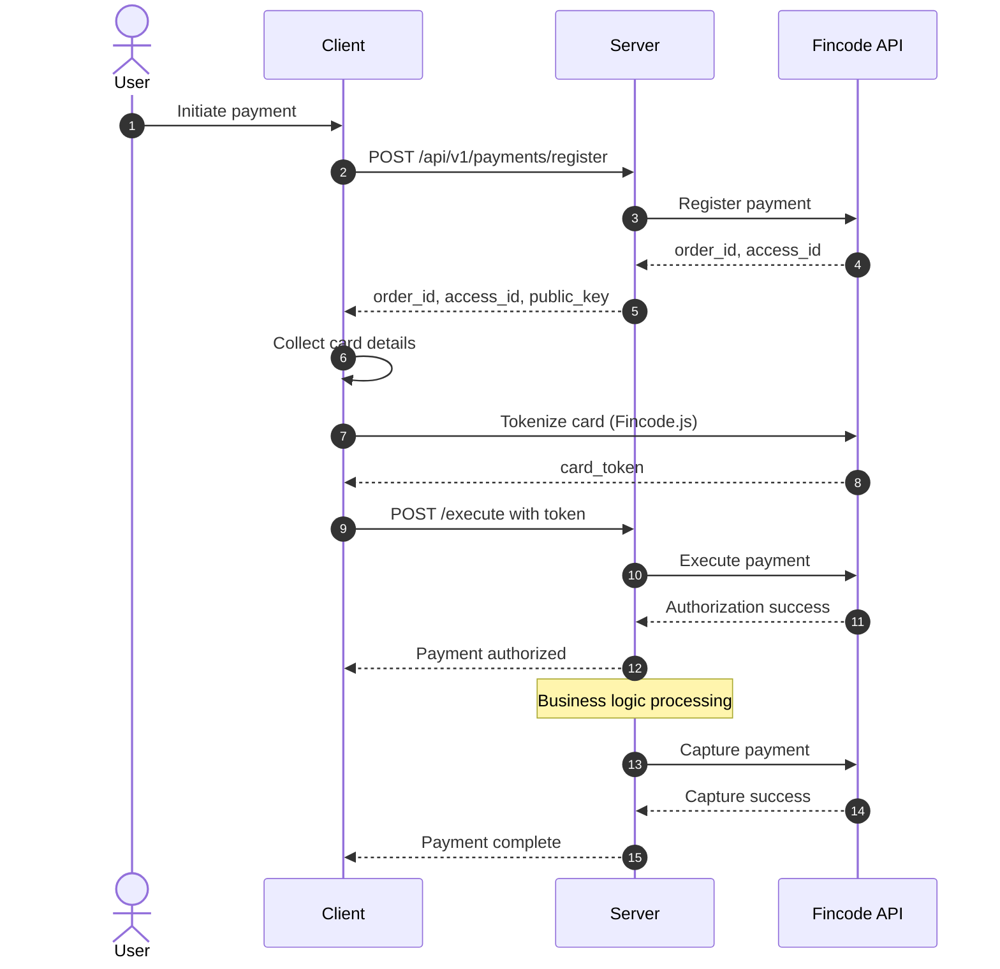

# Fincode Payment Integration - Technical Documentation

## Overview

This document provides comprehensive technical specifications for implementing Fincode payment processing in your Rails application. Fincode supports credit card payments with authorization and capture workflows, enabling secure and flexible payment processing.

**Official Documentation**: [Fincode API Documentation](https://docs.fincode.jp/tutorial)

## Table of Contents

- [Business Objective](#business-objective)
- [Architecture Overview](#architecture-overview)
- [Prerequisites](#prerequisites)
- [Setup and Configuration](#setup-and-configuration)
- [Payment Flow](#payment-flow)
- [API Endpoints](#api-endpoints)
- [Service Layer](#service-layer)
- [Error Handling](#error-handling)
- [Security Considerations](#security-considerations)
- [Testing Strategy](#testing-strategy)
- [Troubleshooting](#troubleshooting)
- [Best Practices](#best-practices)

## Business Objective

### Goal

Implement secure credit card payment processing using Fincode API with support for:
- Authorization and capture workflow (two-step payment)
- Immediate capture option (one-step payment)
- Payment cancellation
- Transaction status tracking

### Key Features

- **Secure tokenization**: Card information is tokenized on client-side using Fincode.js
- **Two-step payment**: Authorize first, capture later (useful for reservations, pre-orders)
- **Flexible capture**: Capture authorized payments when ready to ship
- **Payment tracking**: Track payment status through the entire lifecycle
- **Error handling**: Robust error handling with detailed logging

## Architecture Overview

### Core Components

1. **Client Application** (Web/Mobile)
   - Fincode.js SDK for card tokenization
   - Payment UI and form handling
   - Token generation from card details

2. **Rails Server** (Backend)
   - Payment controller for API endpoints
   - Payment service for Fincode API integration
   - Payment model for data persistence

3. **Fincode Services**
   - Payment registration API
   - Payment execution API
   - Capture/Cancel APIs
   - Payment status retrieval

### Data Flow

```
Client → Tokenize Card → Server Register → Execute Payment → Capture → Complete
   ↓         ↓              ↓                  ↓              ↓          ↓
 Card Info  Token      Payment Record    Authorization    Capture   Success
```

### Payment States

- `pending` - Payment registered but not authorized
- `authorized` - Payment authorized, awaiting capture
- `captured` - Payment completed and funds captured
- `failed` - Payment processing failed
- `cancelled` - Payment cancelled

## Prerequisites

### Required Credentials

You need the following Fincode credentials from your Fincode dashboard:

- **Public Key** (`FINCODE_PUBLIC_KEY`) - Used for client-side tokenization with Fincode.js
- **Secret Key** (`FINCODE_SECRET_KEY`) - Used for server-side API calls
- **API URL** (`FINCODE_API_URL`) - Fincode API endpoint

### Environment Variables

```bash
# Production
FINCODE_API_URL=https://api.fincode.jp
FINCODE_PUBLIC_KEY=pk_live_...
FINCODE_SECRET_KEY=sk_live_...

# Test/Sandbox
FINCODE_API_URL=https://api.test.fincode.jp
FINCODE_PUBLIC_KEY=pk_test_...
FINCODE_SECRET_KEY=sk_test_...
```

### Database Schema

Create a `payments` table with the following structure:

```ruby
# db/migrate/YYYYMMDDHHMMSS_create_payments.rb
class CreatePayments < ActiveRecord::Migration[7.0]
  def change
    create_table :payments do |t|
      t.references :user, null: false, foreign_key: true
      
      # Fincode identifiers
      t.string :fincode_order_id, null: false, index: { unique: true }
      t.string :fincode_access_id, null: false
      t.string :fincode_transaction_id
      
      # Payment details
      t.integer :amount, null: false
      t.integer :status, default: 0, null: false
      t.string :customer_email
      t.string :error_message
      
      # Timestamps for tracking
      t.datetime :authorized_at
      t.datetime :captured_at
      t.datetime :cancelled_at
      
      t.timestamps
    end
    
    add_index :payments, :fincode_order_id
    add_index :payments, :status
  end
end
```

## Setup and Configuration

### 1. Install Dependencies

Add HTTParty to your Gemfile for HTTP requests:

```ruby
# Gemfile
gem 'httparty', '~> 0.21'
```

Run bundle install:

```bash
bundle install
```

### 2. Create Payment Model

```ruby
# app/models/payment.rb
class Payment < ApplicationRecord
  belongs_to :user
  
  # Payment status enum
  enum status: {
    pending: 0,
    authorized: 1,
    captured: 2,
    failed: 3,
    cancelled: 4
  }
  
  # Validations
  validates :fincode_order_id, presence: true, uniqueness: true
  validates :fincode_access_id, presence: true
  validates :amount, presence: true, numericality: { greater_than: 0 }
  validates :customer_email, format: { with: URI::MailTo::EMAIL_REGEXP }, allow_blank: true
  
  # Scopes
  scope :recent, -> { order(created_at: :desc) }
  scope :by_status, ->(status) { where(status: status) }
  
  # Check if payment can be captured
  def capturable?
    authorized? && captured_at.nil?
  end
  
  # Check if payment can be cancelled
  def cancellable?
    (pending? || authorized?) && cancelled_at.nil?
  end
end
```

### 3. Configure Routes

```ruby
# config/routes.rb
Rails.application.routes.draw do
  namespace :api do
    namespace :v1 do
      resources :payments, only: [:show], param: :order_id do
        collection do
          post :register
        end
        member do
          post :execute
          post :capture
          post :cancel
        end
      end
    end
  end
end
```

**Available Routes:**

```
POST   /api/v1/payments/register            # Register new payment
POST   /api/v1/payments/:order_id/execute   # Execute payment with token
POST   /api/v1/payments/:order_id/capture   # Capture authorized payment
POST   /api/v1/payments/:order_id/cancel    # Cancel payment
GET    /api/v1/payments/:order_id           # Get payment details
```

## Payment Flow

### Standard Two-Step Payment Flow

This is the recommended flow for most use cases (e.g., e-commerce, reservations):

```
1. Client initiates payment
   ↓
2. POST /api/v1/payments/register
   - Creates payment record
   - Returns order_id, access_id, and public_key
   ↓
3. Client collects card info and tokenizes using Fincode.js
   - User enters card details in form
   - Fincode.js creates secure token
   ↓
4. POST /api/v1/payments/:order_id/execute
   - Authorizes payment with token
   - Funds are reserved but not captured
   ↓
5. Business logic processing (ship product, confirm reservation, etc.)
   ↓
6. POST /api/v1/payments/:order_id/capture
   - Captures authorized payment
   - Funds are transferred
   ↓
7. Payment complete
```

### Quick Capture Flow (One-Step)

For immediate payment capture (e.g., digital goods, instant services):

```
1. POST /api/v1/payments/register
   ↓
2. Client tokenizes card
   ↓
3. POST /api/v1/payments/:order_id/execute
   ↓
4. POST /api/v1/payments/:order_id/capture
   (Can be called immediately after execute)
   ↓
5. Payment complete
```

### Payment Flow Sequence Diagram



## API Endpoints

### 1. Register Payment

Creates a new payment record and registers it with Fincode.

**Endpoint:** `POST /api/v1/payments/register`

**Authentication:** Required (Bearer token)

**Request Headers:**
```
Authorization: Bearer {user_token}
Content-Type: application/json
```

**Request Body:**
```json
{
  "amount": 1000
}
```

**Request Parameters:**

| Parameter | Type | Required | Description |
|-----------|------|----------|-------------|
| amount | Integer | Yes | Payment amount in smallest currency unit (e.g., cents for USD, yen for JPY). Minimum: 100 |

**Response (Success - 200):**
```json
{
  "success": true,
  "order_id": "ORD_1705392000_a1b2c3d4e5f6",
  "access_id": "a_************************",
  "amount": 1000,
  "public_key": "pk_test_************************"
}
```

**Response Fields:**

| Field | Type | Description |
|-------|------|-------------|
| success | Boolean | Indicates if registration was successful |
| order_id | String | Unique order identifier for this payment |
| access_id | String | Fincode access ID for this payment session |
| amount | Integer | Payment amount |
| public_key | String | Public key for client-side tokenization |

**Response (Error - 422):**
```json
{
  "success": false,
  "error": "Invalid amount"
}
```

**Validation Rules:**
- Amount must be at least 100 (¥100 minimum)
- User must be authenticated
- Email is automatically captured from authenticated user

**Example Usage:**

```javascript
// Client-side JavaScript
const response = await fetch('/api/v1/payments/register', {
  method: 'POST',
  headers: {
    'Authorization': `Bearer ${userToken}`,
    'Content-Type': 'application/json'
  },
  body: JSON.stringify({ amount: 1000 })
});

const data = await response.json();
console.log(data.order_id); // Use this for next steps
```

### 2. Execute Payment

Authorizes the payment using a card token from Fincode.js.

**Endpoint:** `POST /api/v1/payments/:order_id/execute`

**Authentication:** Required

**Request Headers:**
```
Authorization: Bearer {user_token}
Content-Type: application/json
```

**Request Body:**
```json
{
  "token": "tok_************************"
}
```

**Request Parameters:**

| Parameter | Type | Required | Description |
|-----------|------|----------|-------------|
| token | String | Yes | Card token generated by Fincode.js |

**Response (Success - 200):**
```json
{
  "success": true,
  "payment": {
    "fincode_order_id": "ORD_1705392000_a1b2c3d4e5f6",
    "amount": 1000,
    "status": "authorized",
    "authorized_at": "2024-01-16T10:30:00Z",
    "customer_email": "user@example.com"
  }
}
```

**Response (Error - 422):**
```json
{
  "success": false,
  "error": "Already executed"
}
```

**Error Scenarios:**
- Payment already authorized or captured
- Invalid token
- Insufficient funds
- Card declined
- Unauthorized access (not payment owner)

**Example Usage:**

```javascript
// After tokenizing card with Fincode.js
const response = await fetch(`/api/v1/payments/${orderId}/execute`, {
  method: 'POST',
  headers: {
    'Authorization': `Bearer ${userToken}`,
    'Content-Type': 'application/json'
  },
  body: JSON.stringify({ token: cardToken })
});

const data = await response.json();
if (data.success) {
  console.log('Payment authorized!');
}
```

### 3. Capture Payment

Captures an authorized payment. Can also authorize and capture in one step if not yet authorized.

**Endpoint:** `POST /api/v1/payments/:order_id/capture`

**Authentication:** Required

**Request Headers:**
```
Authorization: Bearer {user_token}
Content-Type: application/json
```

**Request Body:**
```json
{}
```

**Response (Success - 200):**
```json
{
  "success": true,
  "payment": {
    "fincode_order_id": "ORD_1705392000_a1b2c3d4e5f6",
    "amount": 1000,
    "status": "captured",
    "authorized_at": "2024-01-16T10:30:00Z",
    "captured_at": "2024-01-16T10:35:00Z"
  },
  "message": "Payment authorized and captured successfully"
}
```

**Features:**
- Automatically authorizes if payment is still pending
- Idempotent - prevents double capture
- Captures full payment amount
- Updates payment status to `captured`

**Error Scenarios:**
- Payment already captured
- Payment cancelled
- Payment failed
- Unauthorized access

**Example Usage:**

```ruby
# Server-side Ruby
def ship_product_and_capture_payment(order_id)
  # Ship the product first
  ship_product(order_id)
  
  # Then capture payment
  payment = Payment.find_by(fincode_order_id: order_id)
  capture_payment(payment)
end
```

### 4. Cancel Payment

Cancels a pending or authorized payment.

**Endpoint:** `POST /api/v1/payments/:order_id/cancel`

**Authentication:** Required

**Request Headers:**
```
Authorization: Bearer {user_token}
Content-Type: application/json
```

**Request Body:**
```json
{}
```

**Response (Success - 200):**
```json
{
  "success": true,
  "message": "Payment cancelled successfully"
}
```

**Response (Error - 422):**
```json
{
  "success": false,
  "error": "Cannot cancel captured payment"
}
```

**Cancellation Rules:**
- Can cancel `pending` payments
- Can cancel `authorized` payments (refunds the hold)
- Cannot cancel `captured` payments (use refund instead)
- Cannot cancel already `cancelled` payments

### 5. Get Payment Details

Retrieves payment information.

**Endpoint:** `GET /api/v1/payments/:order_id`

**Authentication:** Required

**Request Headers:**
```
Authorization: Bearer {user_token}
```

**Response (Success - 200):**
```json
{
  "fincode_order_id": "ORD_1705392000_a1b2c3d4e5f6",
  "amount": 1000,
  "status": "captured",
  "customer_email": "user@example.com",
  "authorized_at": "2024-01-16T10:30:00Z",
  "captured_at": "2024-01-16T10:35:00Z",
  "created_at": "2024-01-16T10:25:00Z"
}
```

**Response (Error - 404):**
```json
{
  "success": false,
  "error": "Not found"
}
```

## Service Layer

### Fincode::PaymentService

The `PaymentService` class encapsulates all interactions with the Fincode API.

**Location:** `lib/fincode/payment_service.rb`

```ruby
module Fincode
  class PaymentService
    include HTTParty

    base_uri ENV['FINCODE_API_URL']
    
    class FincodeError < StandardError; end

    def initialize
      @secret_key = ENV['FINCODE_SECRET_KEY']
      raise FincodeError, 'FINCODE_SECRET_KEY is not configured' if @secret_key.blank?
    end

    # ... methods documented below
  end
end
```

#### Method: `register`

Registers a new payment with Fincode.

**Signature:**
```ruby
def register(order_id:, amount:, customer_info: {})
```

**Parameters:**
- `order_id` (String, required) - Unique order identifier
- `amount` (Integer, required) - Payment amount in smallest currency unit
- `customer_info` (Hash, optional) - Customer information
  - `:email` (String) - Customer email address
  - `:name` (String) - Customer name

**Returns:** Hash containing:
- `id` - Fincode payment ID (same as order_id)
- `access_id` - Access ID for this payment session
- Additional payment details

**Fincode API Call:**
```
POST /v1/payments
```

**Request Body:**
```json
{
  "pay_type": "Card",
  "job_code": "AUTH",
  "amount": "1000",
  "tax": "0",
  "id": "ORD_1705392000_a1b2c3d4e5f6",
  "client_field_1": "user@example.com",
  "client_field_2": "John Doe"
}
```

**Example Usage:**
```ruby
service = Fincode::PaymentService.new
result = service.register(
  order_id: 'ORD_123',
  amount: 1000,
  customer_info: {
    email: 'user@example.com',
    name: 'John Doe'
  }
)
# => { "id" => "ORD_123", "access_id" => "a_...", ... }
```

#### Method: `execute`

Executes payment authorization using a card token.

**Signature:**
```ruby
def execute(order_id:, access_id:, token:, method: '1')
```

**Parameters:**
- `order_id` (String, required) - Order identifier
- `access_id` (String, required) - Fincode access ID from registration
- `token` (String, required) - Card token from Fincode.js
- `method` (String, optional) - Payment method code (default: '1' for lump sum)

**Payment Method Codes:**
- `'1'` - Lump sum (一括払い)
- `'2'` - Installments (分割払い)
- `'3'` - Revolving (リボ払い)

**Returns:** Hash containing transaction details

**Fincode API Call:**
```
PUT /v1/payments/{order_id}/execute
```

**Example Usage:**
```ruby
result = service.execute(
  order_id: 'ORD_123',
  access_id: 'a_...',
  token: 'tok_...'
)
```

#### Method: `capture`

Captures an authorized payment.

**Signature:**
```ruby
def capture(order_id:, access_id:, amount:)
```

**Parameters:**
- `order_id` (String, required) - Order identifier
- `access_id` (String, required) - Fincode access ID
- `amount` (Integer, required) - Amount to capture (usually same as authorized amount)

**Returns:** Hash with capture confirmation

**Fincode API Call:**
```
PUT /v1/payments/{order_id}/capture
```

**Example Usage:**
```ruby
result = service.capture(
  order_id: 'ORD_123',
  access_id: 'a_...',
  amount: 1000
)
```

#### Method: `cancel`

Cancels a payment.

**Signature:**
```ruby
def cancel(order_id:, access_id:)
```

**Parameters:**
- `order_id` (String, required) - Order identifier
- `access_id` (String, required) - Fincode access ID

**Returns:** Hash with cancellation confirmation

**Fincode API Call:**
```
PUT /v1/payments/{order_id}/cancel
```

**Example Usage:**
```ruby
result = service.cancel(
  order_id: 'ORD_123',
  access_id: 'a_...'
)
```

#### Method: `get_payment`

Retrieves payment details from Fincode.

**Signature:**
```ruby
def get_payment(order_id)
```

**Parameters:**
- `order_id` (String, required) - Order identifier

**Returns:** Hash with complete payment information

**Fincode API Call:**
```
GET /v1/payments/{order_id}
```

**Example Usage:**
```ruby
payment_info = service.get_payment('ORD_123')
```

## Error Handling

### Error Types

All Fincode API errors raise `Fincode::PaymentService::FincodeError`.

### HTTP Status Code Handling

| Status Code | Meaning | Handling Strategy |
|-------------|---------|-------------------|
| 200, 201 | Success | Return parsed response |
| 400 | Bad Request | Log error details, raise with message |
| 401 | Unauthorized | Check API credentials |
| 403 | Forbidden | Verify API key permissions |
| 404 | Not Found | Payment record doesn't exist |
| 500-599 | Server Error | Log error, suggest retry |

### Error Response Handling

```ruby
def handle_response(response)
  case response.code
  when 200, 201
    response.parsed_response
  when 400
    errors = parse_errors(response)
    Rails.logger.error("Fincode 400: #{errors}")
    raise FincodeError, "Bad Request: #{errors}"
  when 401
    Rails.logger.error("Fincode 401: Unauthorized")
    raise FincodeError, "Unauthorized - Check your API credentials"
  when 403
    errors = parse_errors(response)
    Rails.logger.error("Fincode 403: Forbidden")
    raise FincodeError, "Forbidden - API key lacks permission: #{errors}"
  when 404
    raise FincodeError, "Payment not found"
  when 500..599
    Rails.logger.error("Fincode 5xx: Server error")
    raise FincodeError, "Fincode server error - Please try again later"
  else
    Rails.logger.error("Fincode #{response.code}: #{response.body}")
    raise FincodeError, "Payment processing failed (HTTP #{response.code})"
  end
end
```

### Common Error Messages

| Error Message | Cause | Solution |
|---------------|-------|----------|
| "Invalid amount" | Amount < 100 | Ensure amount is at least 100 |
| "Unauthorized" | User doesn't own payment | Verify user ownership |
| "Already executed" | Duplicate execution | Check payment status first |
| "FINCODE_SECRET_KEY is not configured" | Missing env variable | Set environment variable |
| "Payment not found" | Invalid order_id | Verify order_id exists |
| "Bad Request" | Invalid parameters | Check request format |

### Error Handling in Controller

```ruby
def register
  # ... registration logic
rescue Fincode::PaymentService::FincodeError => e
  Rails.logger.error("Payment registration failed: #{e.message}")
  render json: { 
    success: false, 
    error: e.message 
  }, status: :unprocessable_entity
end
```

### Client-Side Error Handling

```javascript
try {
  const response = await fetch('/api/v1/payments/register', {
    method: 'POST',
    headers: {
      'Authorization': `Bearer ${token}`,
      'Content-Type': 'application/json'
    },
    body: JSON.stringify({ amount: 1000 })
  });
  
  const data = await response.json();
  
  if (!data.success) {
    // Handle error
    console.error('Payment failed:', data.error);
    showErrorMessage(data.error);
  }
} catch (error) {
  console.error('Network error:', error);
  showErrorMessage('Network error occurred');
}
```

## Security Considerations

### API Key Security

**Critical Security Rules:**

1. **Never expose secret key in client-side code**
   ```javascript
   // ❌ WRONG - Never do this
   const secretKey = 'sk_live_...';
   
   // ✅ CORRECT - Public key only
   const publicKey = 'pk_live_...';
   ```

2. **Store keys in environment variables**
   ```ruby
   # ❌ WRONG
   SECRET_KEY = 'sk_live_...'
   
   # ✅ CORRECT
   SECRET_KEY = ENV['FINCODE_SECRET_KEY']
   ```

3. **Use different keys for environments**
   ```bash
   # Development
   FINCODE_SECRET_KEY=sk_test_...
   
   # Production
   FINCODE_SECRET_KEY=sk_live_...
   ```

4. **Rotate keys periodically**
   - Generate new keys every 6-12 months
   - Update in all environments
   - Monitor for unauthorized usage

### Authentication & Authorization

**User Authentication:**
```ruby
before_action :authenticate_user!, except: [:create]
```

**Payment Ownership Verification:**
```ruby
def execute
  payment = Payment.find_by!(fincode_order_id: params[:order_id])
  
  unless payment.user_id == current_user.id
    return render json: { 
      success: false, 
      error: 'Unauthorized' 
    }, status: :forbidden
  end
  
  # Continue with execution
end
```

### Token Security

**Important Token Rules:**

1. **Tokens are single-use**
   - Each token can only be used once
   - Generate new token for retry

2. **Tokens expire**
   - Default expiration: 30 minutes
   - Generate new token if expired

3. **Never log tokens**
   ```ruby
   # ❌ WRONG
   Rails.logger.info("Token: #{token}")
   
   # ✅ CORRECT
   Rails.logger.info("Payment executed for order: #{order_id}")
   ```

4. **Transmit over HTTPS only**
   - Force SSL in production
   - Use secure headers

### PCI Compliance

**Your application never handles raw card data:**

1. Card details are collected client-side
2. Fincode.js tokenizes the card
3. Only token is sent to your server
4. Your server never sees card numbers

This keeps you PCI compliant by minimizing your scope.

### Data Protection

```ruby
# config/environments/production.rb
config.force_ssl = true

# Add secure headers
config.action_dispatch.default_headers = {
  'X-Frame-Options' => 'SAMEORIGIN',
  'X-Content-Type-Options' => 'nosniff',
  'X-XSS-Protection' => '1; mode=block'
}
```

## Testing Strategy

### Test Environment Setup

```bash
# .env.test
FINCODE_API_URL=https://api.test.fincode.jp
FINCODE_PUBLIC_KEY=pk_test_************************
FINCODE_SECRET_KEY=sk_test_************************
```

### Test Card Numbers

Fincode provides test cards for different scenarios:

**Successful Transactions:**
```
Card Number: 4111111111111111
Expiry: Any future date (MM/YY)
CVV: Any 3 digits
Name: Any name
```

**Declined Card:**
```
Card Number: 4000000000000002
Result: Card declined error
```

**Insufficient Funds:**
```
Card Number: 4000000000009995
Result: Insufficient funds error
```

**Expired Card:**
```
Card Number: 4111111111111111
Expiry: Any past date
Result: Expired card error
```
